# 软件系统优化 实验报告1
温兆和 10205501432
## 常用工具命令操作练习
### `$uname -a`
#### 执行结果
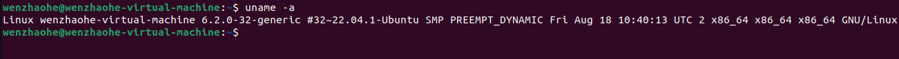
#### 命令文档
执行`man uname`命令后，我们得到
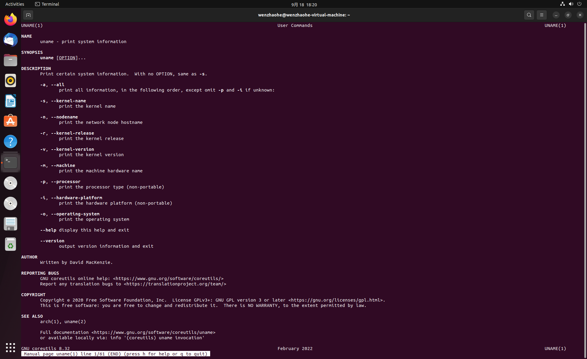
#### 简答
**分析输出结果包含了哪些信息。**
由命令文档可见，`uname`的作用是打印系统信息，而`uname -a`是按照内核名称、网络节点上的主机名称、内核发行号、内核版本、主机的硬件架构名称、处理器类型（如果已知）、硬件平台（如果已知）和操作系统名称的顺序输出全部的系统信息。其他选项分别输出以上信息中的某一个。

所以，`uname -a`的输出结果就包含内核名称、网络节点上的主机名称、内核发行号、内核版本、主机的硬件架构名称、处理器类型、硬件平台和操作系统名称这些系统信息。

**Linux内核版本与指令集架构是什么?**
由执行结果可知，Linux内核版本是#32~22.04.1-Ubuntu SMP PREEMPT_DYNAMIC Fri Aug 18 10:40:13 UTC 2，指令集架构是x86_64。

### `$sysctl -a`
#### 执行结果
由于输出较长，这里执行`sysctl -a | head -n 10`，只取输出的前十行。
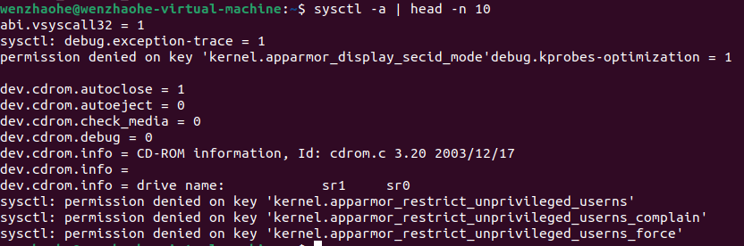
#### 命令文档
执行`man sysctl`命令后，我们得到
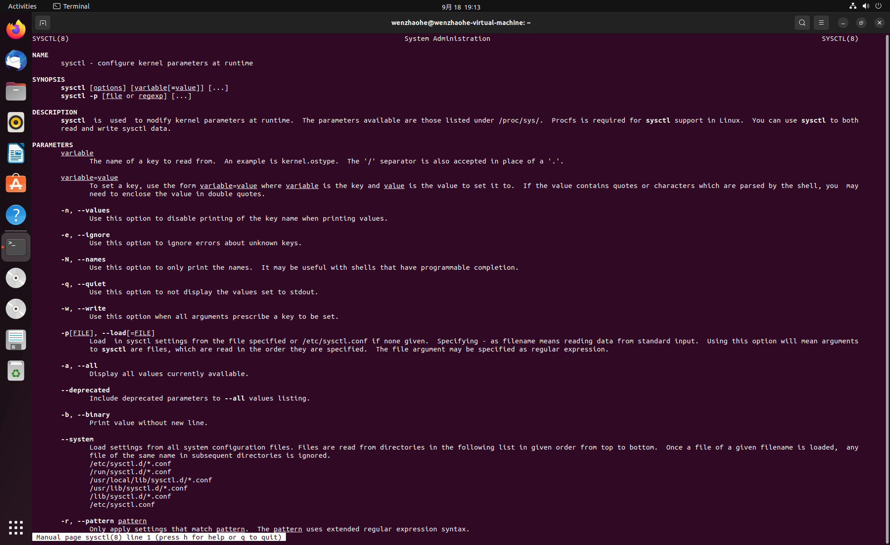
#### 简答
**该命令的功能是什么？`-a`选项的含义是什么？**
由命令文档可见，`sysctl`的功能是修改内核在运行时的参数，而`-a`选项的含义是“all”，表示输出内核当前所有可用的参数的值。

**输出结果与目录`/proc/sys`的关系是什么？**
由命令文档中的“DESCRIPTION”部分可见，所有可用的内核参数都被列在目录`/proc/sys`下面。

### `$top`
#### 执行结果
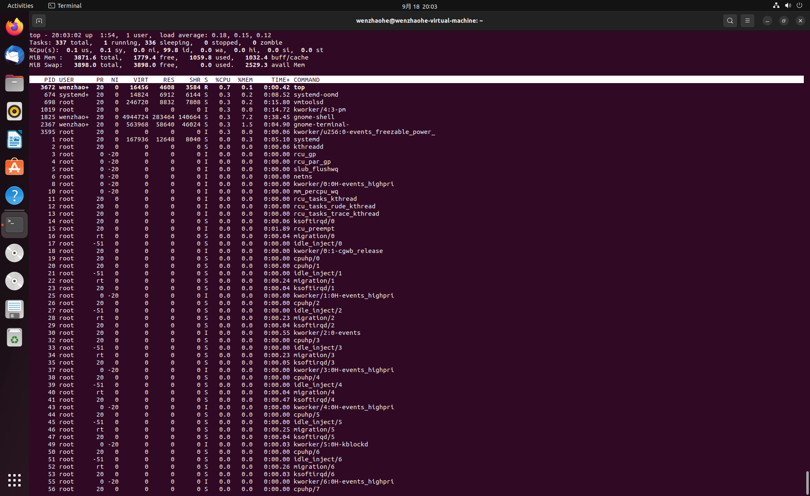
#### 命令文档
执行`man top`命令后，我们得到
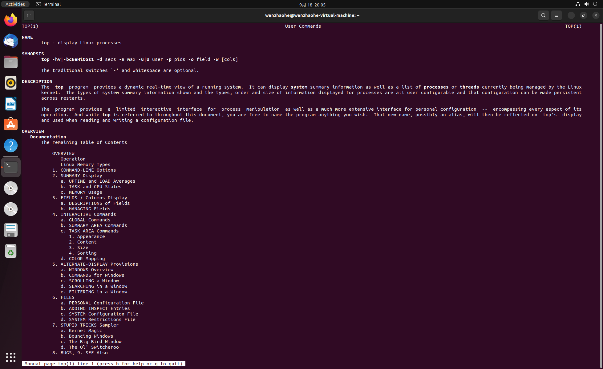
#### 简答
**分析输出结果包含了哪些信息，每一栏分别表示什么？**
从执行结果和命令文档来看，`top`命令显示了计算机中正在运行的进程的实时信息。具体来说，`PID`表示进程的标识符，`USER`表示该进程的用户名，`PR`表示进程的优先级，`NI`表示进程的优先级调整值，`VIRT`表示进程使用的虚存的大小，`RES`表示进程使用的物理内存的大小，`SHR`表示进程共享的内存大小，`S`表示进程的状态（睡眠/运行/僵死等），`%CPU`表示进程占用多少CPU，`%MEM`表示进程占用多少内存，`TIME+`表示进程的累计运行时间，`COMMAND`表示启动进程的命令。这些信息都被显示在命令文档的“3. FIELDS / Columns”部分中，具体如下图所示。
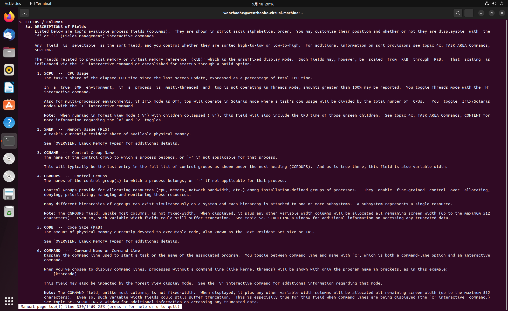

### `$dmidecode`
#### 执行结果
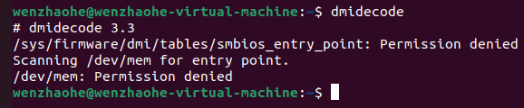

看起来这是个需要sudo权限的命令。由于输出较长，这里只取输出的前五十行。在命令行中输入`sudo dmidecode | head -n 50`之后，就得到了正确的输出。
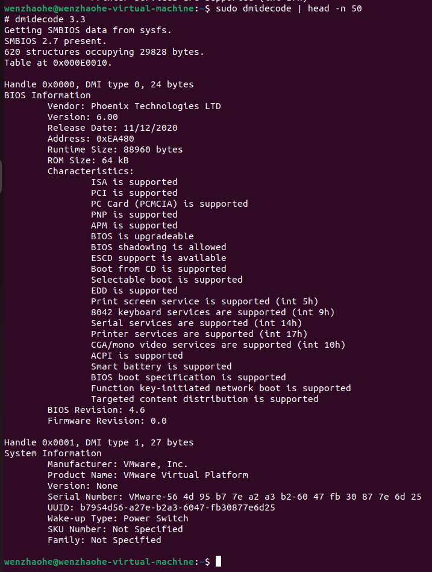
#### 命令文档
执行`man dmidecode`命令后，我们得到
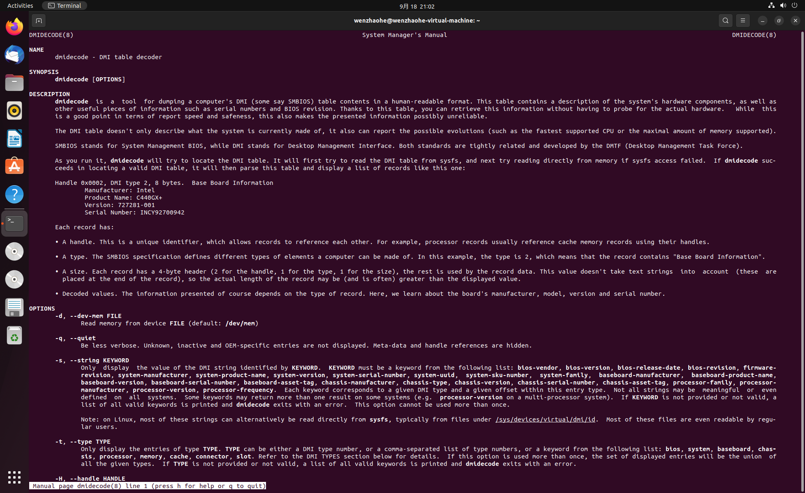
#### 简答
**该命令的功能是什么？**
从命令文档中的“DESCRIPTION”部分（实际上也可以从“DMI decode”的字面意思猜出）可知，`dmidecode`命令的作用是将DMI（Desktop Management Interface）中的数据解码，以人类可读的形式展示。我们可以由此在无需探测实际硬件的情况下获取计算机的硬件信息，以及序列号和BIOS版本等其他有用的信息。此外，执行这条命令还可以报告硬件可能的变化趋势。

**观察输出结果，以内存为例，可以获得哪些信息？**
在命令文档的“OPTIONS”部分中，我们发现执行`sudo dmidecode -t memory`命令可以只打印与内存相关的信息。
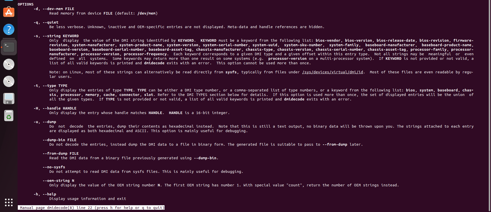

为了获取与内存相关的输出，执行`sudo dmidecode -t memory`命令，得到的其中一条输出如下图所示：
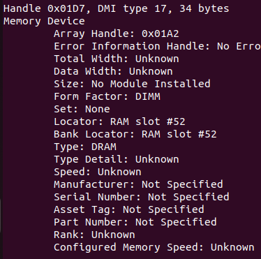

其中，我们可以得到内存总宽度（Total Width）、数据总宽度（Data Width）、内存模块大小（Size）、内存类型（Type）、内存速度（Speed）和内存等级（Rank）等与内存有关的重要信息。

### `$numactl -H`
#### 执行结果
输入`sudo apt install numactl`安装numactl并执行`numactl -H`后，我们得到
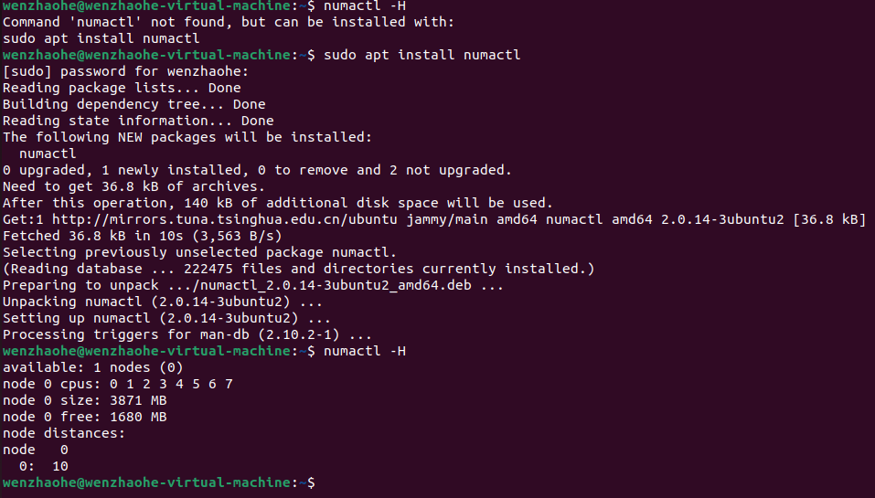
#### 命令文档
执行`man numactl`命令后，我们得到
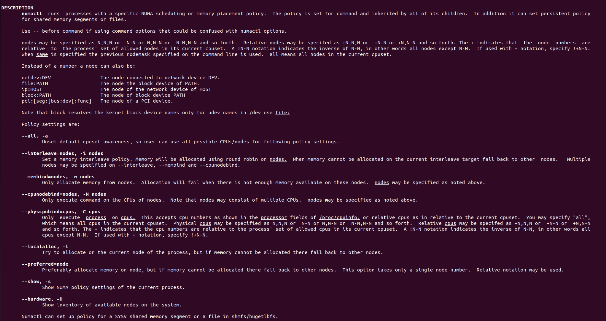
#### 简答
**该命令的功能是什么？`-H`选项的含义是什么？**
从命令文档的"DESCRIPTION"部分可知，`numactl`命令被用来运行具有特定NUMA（非一致性内存访问）调度或者内存防治策略的进程。此外，`-H`选项可以列出系统中所有可用节点的清单。

**NUMA节点数量有多少个？**
从执行结果可以看出，只有一个可用的节点（节点0）。

### `$lscpu`与`$cat /proc/cpuinfo`
#### 执行结果
**`lscpu`**
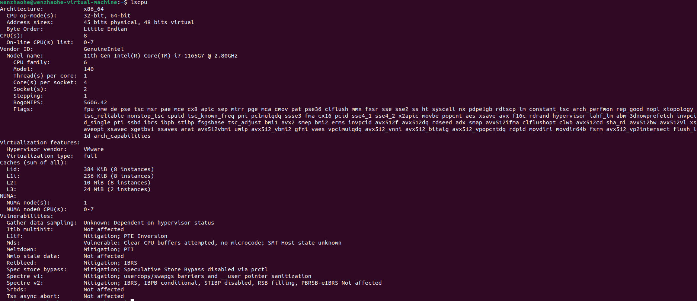
**`cat /proc/cpuinfo`**
由于输出较长，这里只取输出的前二十行。在命令行中输入`cat /proc/cpuinfo | head -n 20`之后，我们得到
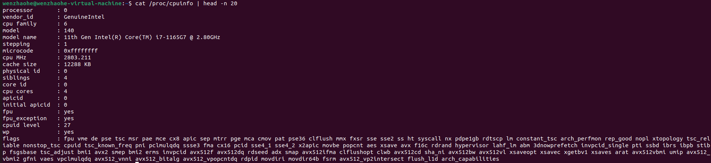
#### 命令文档
由于`cat`只是一个比较基础的显示文件内容的命令，这里不再查看它的命令文档。
执行`man lscpu`命令后，我们得到
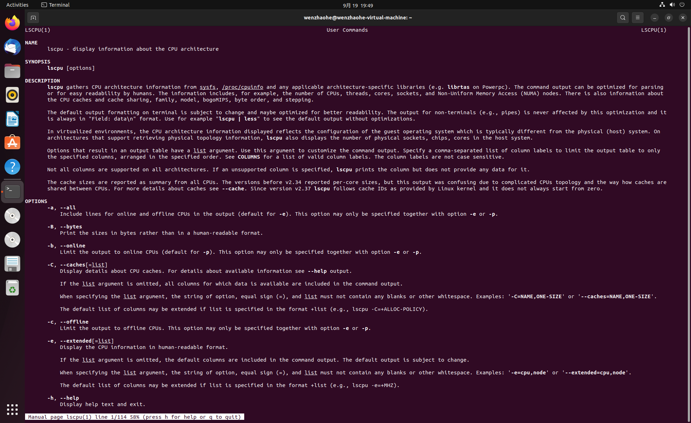
#### 简答
**以`lscpu`为例，分析输出结果包含了哪些信息。**
从`lscpu`的命令文档不难看出，这条命令会从包括`sysfs`和`/proc/cpuinfo`在内的任何可能的来源收集CPU体系结构的信息，并以人类容易阅读的形式展现出来。具体来说，这些信息包括CPU数量、线程数量、内核数量、套接字数量、NUMA节点的数量，以及缓存分配、字节序等信息。

从执行结果可以看出，这台机器的体系架构是x86_64，物理地址是四十五位，虚拟地址是四十八位，是小端法的机器，有八个CPU，每个内核一个线程，L1、L2、L3 Cache的大小分别是640KB、10MB和24MB。输出结果还包含了本机的其他信息。

**处理器型号是什么？包含多少个物理核（physical core）？是否有硬件线程（hardware thread）？**
从输出结果来看，处理器的型号是11th Gen Intel(R) Core(TM) i7-1165G7 @ 2.80GHz，有八个物理核。由于每个内核只有一个线程，所以本机没有硬件线程。

**简要比较两种命令的差别。**
第一，`lscpu`以包括`/proc/cpuinfo`在内的任何可能的来源收集信息，`cat /proc/cpuinfo`的输出只不过是`lscpu`输出的真子集，所以`lscpu`的输出内容更丰富。

第二，`lscpu`的输出是按照人类的阅读习惯经过整理的，而`cat /proc/cpuinfo`直接输出系统文件的内容，所以`lscpu`的输出可读性更强，而`cat /proc/cpuinfo`的输出显得纷繁冗杂。

### `$free`
#### 执行结果
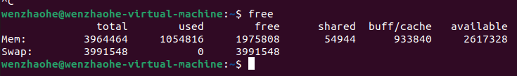
#### 命令文档
执行`man free`命令后，我们得到
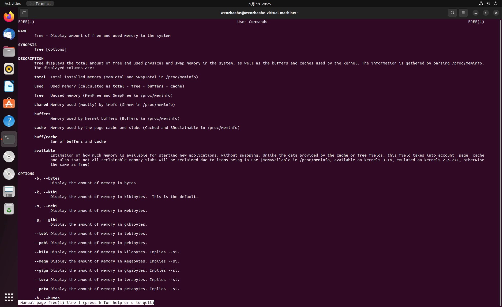
#### 简答
**分析输出结果，解释结果显示两行数据的含义。**
从命令文档来看，`free`命令显示系统中使用过的和未使用过的物理内存和交换内存，以及内核使用的缓冲区和缓存。具体到输出结果，第一行是物理内存，第二行是交换内存，各列从左至右分别是总的内存大小、使用过的内存大小、未使用过的内存大小、（主要被）tmpfs使用的内存的大小、内核缓冲区和缓存使用的内存大小以及对于目前可以被新启动的进程使用的内存大小的估计。

**这些数据以什么为单位的？**
从命令文档的“OPTIONS”部分可以看出，在选项`-k`下面写着“This is the default.”。所以，在没有任何选项的情况下，输出的数据以kibibytes为单位。

### `$vmstat 1`、`$mpstat -P ALL 1`、`$pidstat 1`和`$iostat -xz 1`
#### 执行结果
**`vmstat 1`**
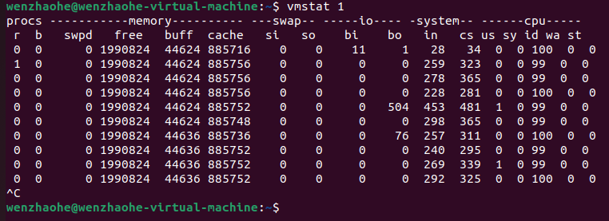
**`mpstat -P ALL 1`**
在运行`sudo apt install sysstat`安装`sysstat`后运行`mpstat -P ALL 1`，我们得到
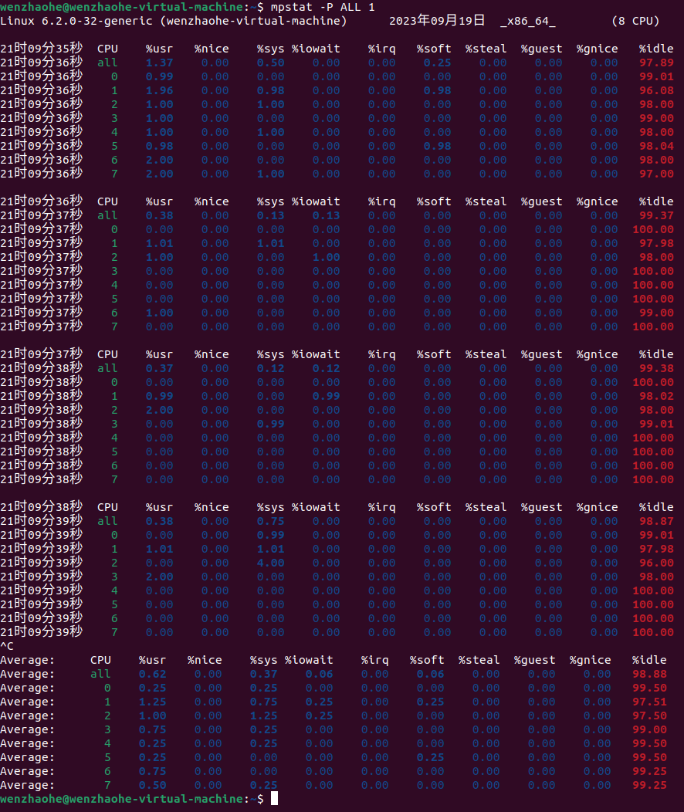
**`pidstat 1`**
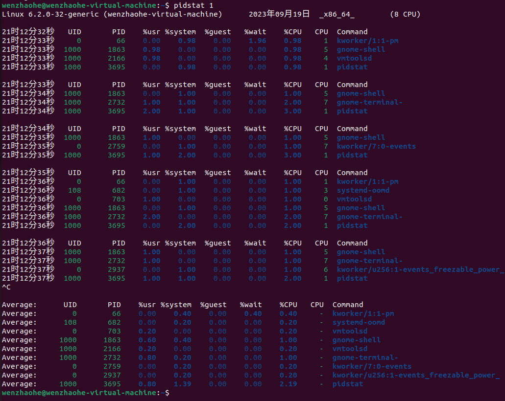
**`iostat -xz 1`**
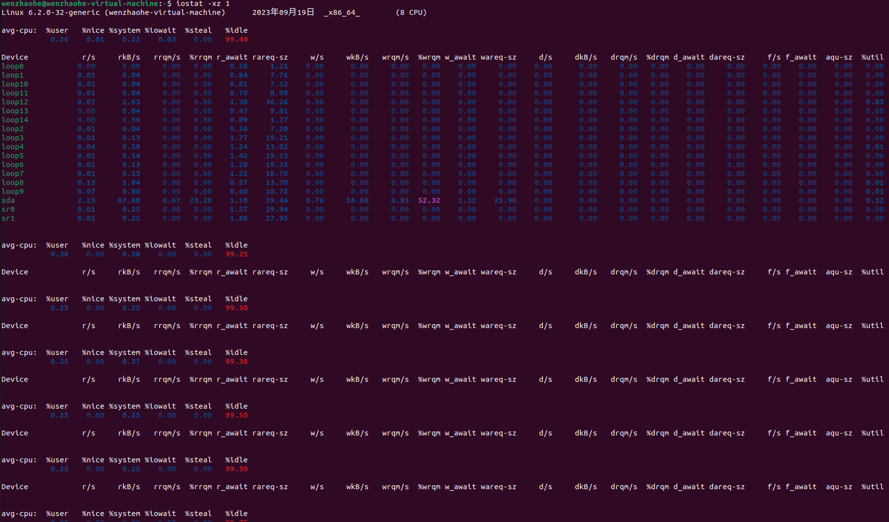
#### 命令文档
**`vmstat 1`**
执行`man vmstat`命令后，我们得到
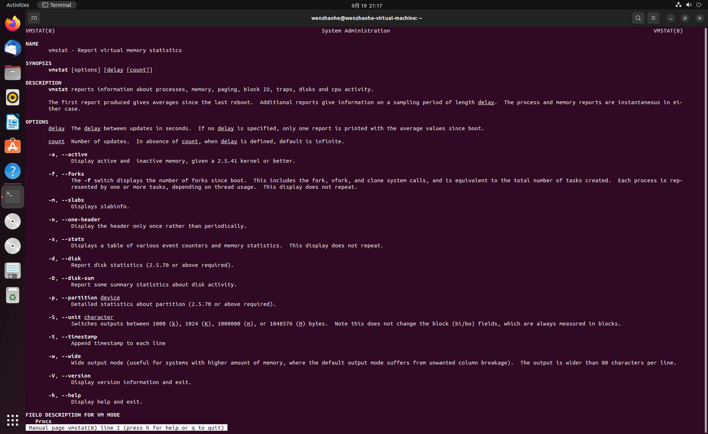
**`mpstat -P ALL 1`**
执行`man mpstat`命令后，我们得到
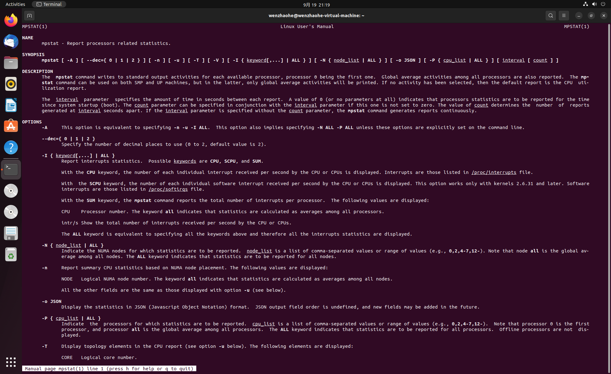
**`pidstat 1`**
执行`man pidstat`命令后，我们得到
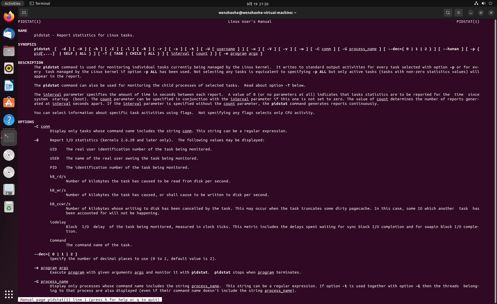
**`iostat -xz 1`**
执行`man iostat`命令后，我们得到
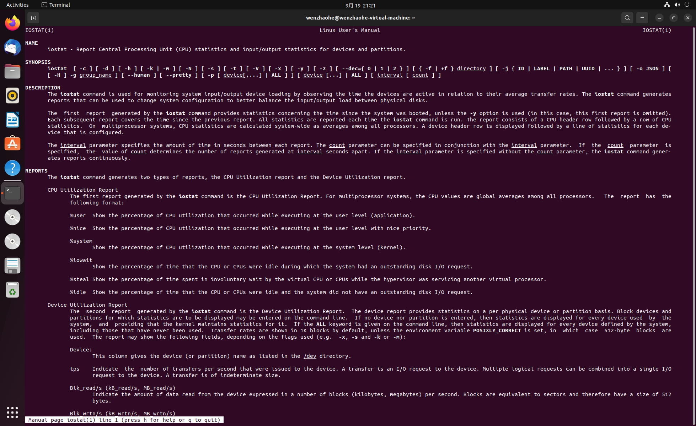
#### 简答
**对于这4条命令，命令传入的参数`1`表示什么意思？**
从四个命令文档的“SYNOPSIS”部分可以看出，这个`1`对应的位置是`delay`或者`interval`，所以应该是每一秒采集一次的意思。

**比较这 4 条命令分别统计了哪些方面信息。**
从命令文档的“NAME”和“DESCRIPTION”两个部分可以看出，`vmstat`输出关于虚拟内存的统计信息，包括关于进程、内存、I/O、磁盘和CPU的信息。第一次输出的是最近一次开机到执行命令的平均情况，之后每一次都输出`delay`的这段时间里的统计信息；`mpstat`输出的是关于处理器的统计信息；`pidstat`输出的是关于Linux中运行的各个任务的统计信息；`iostat`输出的是CPU和磁盘I/O的统计信息。

### `$sar -n DEV 1`
#### 执行结果
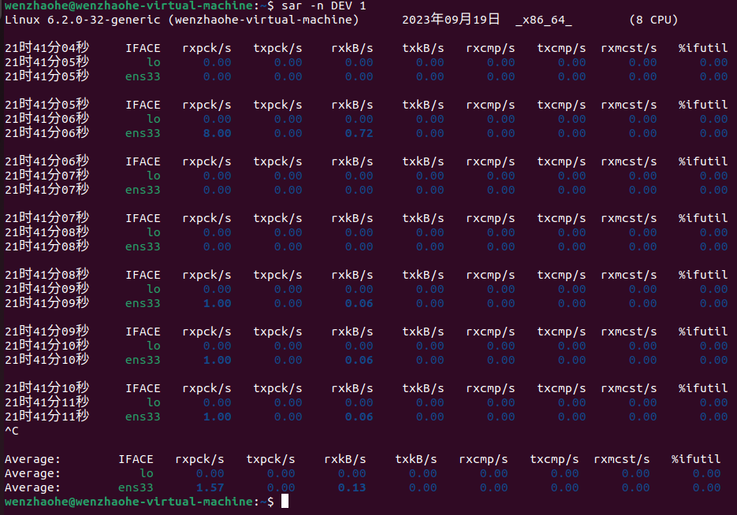
#### 命令文档
执行`man sar`命令后，我们得到
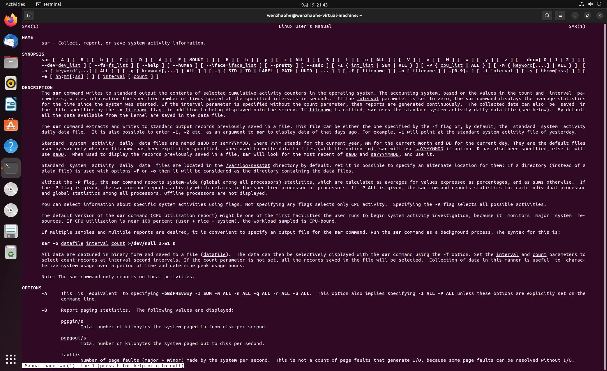
#### 简答
**命令传入的参数`1`表示什么意思？**
从命令文档的“SYNOPSIS”部分可以看出，这个`1`对应的位置是`interval`，所以应该是每一秒采集一次的意思。

**选项`-n DEV`，会获得哪些性能数据？**
从命令文档的“OPTIONS”部分可以看出，`-n DEV`选项会报告所有网络设备和接口（如果没有`--iface`选项）的统计信息，具体来说：
- `rxpck/s`表示每秒收到的网络包总数；
- `txpck/s`表示每秒发送的网络包总数；
- `rxkB/s`表示每秒收到的总KB数；
- `txkB/s`表示每秒发送的总KB数；
- `rxcmp/s`表示每秒收到的压缩包总数；
- `txcmp/s`表示每秒发送的压缩包总数；
- `rxmcst/s`表示每秒收到的多播数据包总数；
- ` %ifutil`表示网络接口的使用率。
具体如下图所示：
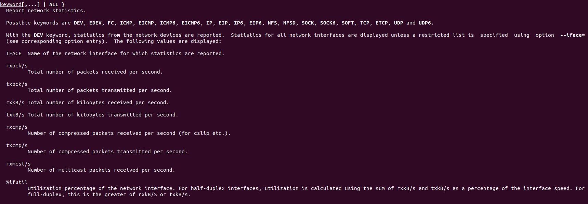

## MIT 6.172  “Homework 1: Getting Started” Write-up 2-8
### Write-up 2
**Answer the questions in the comments in `pointer.c`. For example, why are some of the statements valid and some are not? **
``` c
// Copyright (c) 2012 MIT License by 6.172 Staff

#include <stdio.h>
#include <stdlib.h>
#include <stdint.h>

int main(int argc, char * argv[]) {  // What is the type of argv? Sequence of pointer to the type "char".
  int i = 5;
  // The & operator here gets the address of i and stores it into pi
  int * pi = &i;
  // The * operator here dereferences pi and stores the value -- 5 --
  // into j.
  int j = *pi;

  char c[] = "6.172";
  char * pc = c;  // Valid assignment: c acts like a pointer to c[0] here.
  char d = *pc;
  printf("char d = %c\n", d);  // What does this print? char d = 6

  // compound types are read right to left in C.
  // pcp is a pointer to a pointer to a char, meaning that
  // pcp stores the address of a char pointer.
  char ** pcp;
  pcp = argv;  // Why is this assignment valid? Because argv is a sequence of pointer to the type "char", and sequence can also be regarded as a kind of "pointer".

  const char * pcc = c;  // pcc is a pointer to char constant
  char const * pcc2 = c;  // What is the type of pcc2? A pointer to the type char constant.

  // For each of the following, why is the assignment:
  *pcc = '7';  // invalid? It's invalid because *pcc is the char variable pcc pointing to, which is constant. So, the value of *pcc cannot be verified.
  pcc = *pcp;  // valid? It's valid because pcc is a pointer to type "char" and pcc itself is not constant. On the other hand, '*pcp' is the first entry of argv, a sequence of pointer to the type "char", which means that pcp is also a pointer to "char". So, the value of pcc can be changed to that of *pcp.
  pcc = argv[0];  // valid? It's valid because pcc is a pointer to type "char" and pcc itself is not constant. On the other hand, 'argv[0]' is the first entry of argv, a sequence of pointer to the type "char", which means that argv[0] is also a pointer to "char". So, the value of pcc can be changed to that of argv[0].

  char * const cp = c;  // cp is a const pointer to char
  // For each of the following, why is the assignment:
  cp = *pcp;  // invalid? It's invalid because cp is constant and it's value cannot be changed.
  cp = *argv;  // invalid? It's invalid because cp is constant and it's value cannot be changed.
  *cp = '!';  // valid? It's valid because *cp is the char variable cp pointing to, which is not constant. So, the value of *cp can be changed.

  const char * const cpc = c;  // cpc is a const pointer to char const
  // For each of the following, why is the assignment:
  cpc = *pcp;  // invalid? It's invalid because cpc is constant and it's value cannot be changed..
  cpc = argv[0];  // invalid? It's invalid because cpc is constant and it's value cannot be changed..
  *cpc = '@';  // invalid? It's invalid because *cpc is the char variable cpc pointing to, which is also constant. So, the value of *cpc cannot be changed.

  return 0;
}
```

### Write-up 3
**For each of the types in the `sizes.c` exercise above, print the size of a pointer to  that type. Recall that obtaining the address of an array or struct requires the `&` operator. Provide the output of your program (which should include the sizes of both the actual type and a pointer to it) in the writeup.**
```c
// Copyright (c) 2012 MIT License by 6.172 Staff

#include <stdio.h>
#include <stdlib.h>
#include <stdint.h>

int main() {
  // Please print the sizes of the following types:
  // int, short, long, char, float, double, unsigned int, long long
  // uint8_t, uint16_t, uint32_t, and uint64_t, uint_fast8_t,
  // uint_fast16_t, uintmax_t, intmax_t, __int128, and student

  // Here's how to show the size of one type. See if you can define a macro
  // to avoid copy pasting this code.
  printf("size of %s : %zu bytes \n", "int", sizeof(int));
  // e.g. PRINT_SIZE("int", int);
  //      PRINT_SIZE("short", short);

  // Alternatively, you can use stringification
  // (https://gcc.gnu.org/onlinedocs/cpp/Stringification.html) so that
  // you can write
  // e.g. PRINT_SIZE(int);
  //      PRINT_SIZE(short);

  // Composite types have sizes too.
  typedef struct {
    int id;
    int year;
  } student;

  student you;
  you.id = 12345;
  you.year = 4;

  printf("size of %s : %zu bytes \n", "pointer to int", sizeof(&you.id));

  // Array declaration. Use your macro to print the size of this.
  int x[5];

  // You can just use your macro here instead: PRINT_SIZE("student", you);
  printf("size of %s : %zu bytes \n", "student", sizeof(you));
  printf("size of %s : %zu bytes \n", "pointer to struct student", sizeof(&you));
  printf("size of %s : %zu bytes \n", "int sequence", sizeof(x));
  printf("size of %s : %zu bytes \n", "pointer to int sequence", sizeof(&x));

  return 0;
}
```
执行`make sizes && ./sizes`后，我们得到
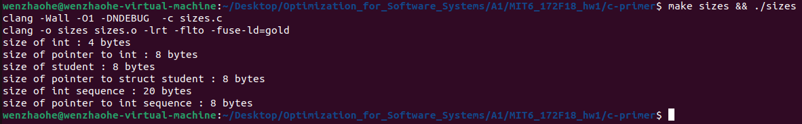

### Write-up 4
**File `swap.c` contains the code to swap two integers. Rewrite the `swap()` function using pointers and make appropriate changes in `main()` function so that the values are  swapped with a call to `swap()`. Compile the code with `make swap` and run the program with `./swap`. Provide your edited code in the writeup. Verify that the results of both `sizes.c` and `swap.c` are correct by using the python script `verifier.py`.**
```c
// Copyright (c) 2012 MIT License by 6.172 Staff

#include <stdio.h>
#include <stdlib.h>
#include <stdint.h>

void swap(int *i, int *j) {
  int temp = *i;
  *i = *j;
  *j = temp;
}

int main() {
  int k = 1;
  int m = 2;
  swap(&k, &m);
  // What does this print?
  printf("k = %d, m = %d\n", k, m);

  return 0;
}
```
执行`make swap`编译以上代码，并通过`./swap`执行代码，我们得到
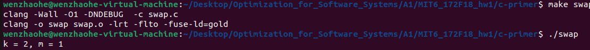

可见，两个变量的值被成功地交换了。

### Write-up 5
**Now, what do you see when you type `make clean`; `make`? **
执行`make`命令，我们得到
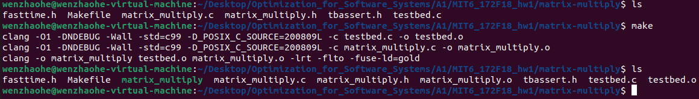

容易发现，目录下出现了`matrix_multiply`等可执行文件。

执行`make clean`，我们得到
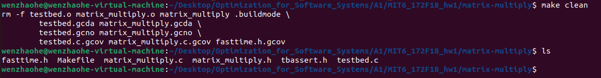

容易发现，刚刚编译得到的可执行文件都被删除了，目录下剩下的文件和编译前一样。

再执行`make`，我们得到
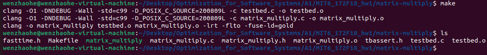

可以发现，目录下的`matrix_multiply.c`等C代码被重新编译，生成相应的可执行文件。

### Write-up 6
**What output do you see from AddressSanitizer regarding the memory bug? Paste it into your writeup here.**
逐条执行实验手册上的编译指令并执行`./matrix_multiply`运行代码，我们得到
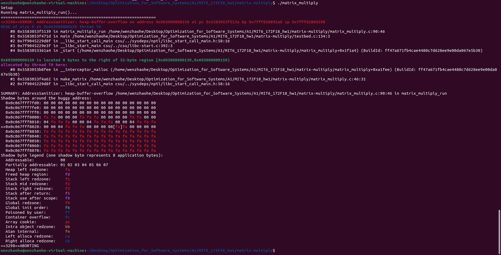

输出的警告信息显示程序运行的过程中出现了缓冲区溢出的情况。

### Write-up 7
**After you fix your program, run `./matrix_multiply -p`. Paste the program output showing that the matrix multiplication is working correctly. **
重新编译代码并执行`valgrind ./matrix_multiply -p`后，我们得到
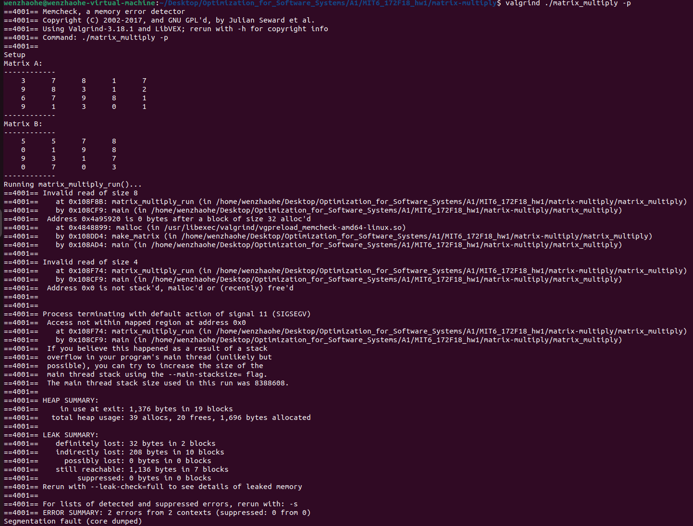

可以发现，`matrix_multiply_run`函数尝试读取了一个无效的内存地址，导致了段错误。它发生在`0x108F8B`处。我们使用gdb打印出`matrix_multiply_run`函数的汇编代码:
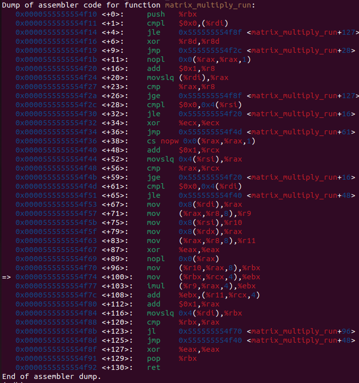

大致可以判断发生问题的位置出在结束读取矩阵A，转而读取矩阵B的地方。结合执行代码时打印出的矩阵中矩阵A的列数比矩阵B的行数多了一，可以判断，由于矩阵A本来应该是四列，而在生成矩阵时多生成了一列，导致读取矩阵A的最后一列时读到了无效的地址。所以，我们只需把`testbed.c`中的
```c
  A = make_matrix(kMatrixSize, kMatrixSize+1);
  B = make_matrix(kMatrixSize, kMatrixSize);
  C = make_matrix(kMatrixSize, kMatrixSize);
```
改成
```c
  A = make_matrix(kMatrixSize, kMatrixSize);
  B = make_matrix(kMatrixSize, kMatrixSize);
  C = make_matrix(kMatrixSize, kMatrixSize);
```
即可。
此后，重新编译文档并再次执行`matrix_multiply`，我们得到
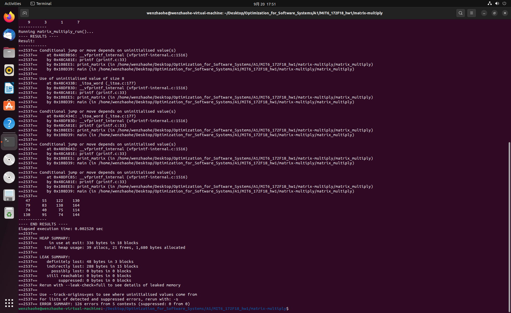

可见，在打印矩阵B之后、矩阵C之前出现了引用未初始化变量的情况。打开代码，发现运算矩阵C时，我们是在矩阵C前一次迭代的值的基础上加上某个值的，但是在第一轮迭代之前、执行`make_matrix(C)`之后我们并没有初始化矩阵C的值。所以，合适的做法是，修改`make_matrix()`函数，在初始化矩阵之后将其初始化为零矩阵，具体来说，把
```c
// Allocates a row-by-cols matrix and returns it
matrix* make_matrix(int rows, int cols) {
  matrix* new_matrix = malloc(sizeof(matrix));

  // Set the number of rows and columns
  new_matrix->rows = rows;
  new_matrix->cols = cols;

  // Allocate a buffer big enough to hold the matrix.
  new_matrix->values = (int**)malloc(sizeof(int*) * rows);
  for (int i = 0; i < rows; i++) {
    new_matrix->values[i] = (int*)malloc(sizeof(int) * cols);
  }

  return new_matrix;
}
```
修改为
```c
// Allocates a row-by-cols matrix and returns it
matrix* make_matrix(int rows, int cols) {
  matrix* new_matrix = malloc(sizeof(matrix));

  // Set the number of rows and columns
  new_matrix->rows = rows;
  new_matrix->cols = cols;

  // Allocate a buffer big enough to hold the matrix.
  new_matrix->values = (int**)malloc(sizeof(int*) * rows);
  for (int i = 0; i < rows; i++) {
    new_matrix->values[i] = (int*)malloc(sizeof(int) * cols);
    for (int j = 0; j < cols; j++)
    {
          new_matrix -> values [i][j] = 0;
    }
  }

  return new_matrix;
}
```
修改后重新编译文档并再次执行`matrix_multiply`，我们得到
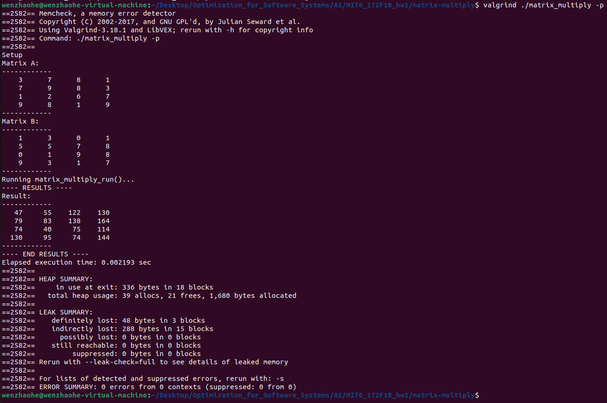

现在Valgrind没有再报任何错误。

### Write-up 8
**Paste the output from Valgrind showing that there is no error in your program. **
首先执行`valgrind --leak-check=full ./matrix_multiply -p`，我们得到
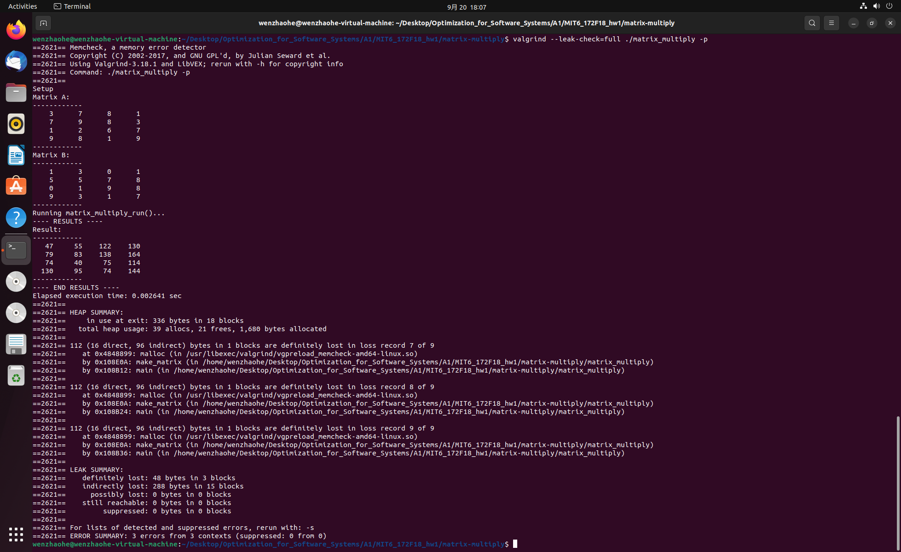

和实验手册显示的结果一样，这段代码是存在内存泄漏的。所以，我们修改`testbed.c`，在`main()`函数的末尾加上释放内存的代码。具体来说，把
```c
...
if (show_usec) {
    double elapsed = tdiff(time1, time2);
    printf("Elapsed execution time: %f usec\n",
           elapsed * (1000.0 * 1000.0));
  } else {
    double elapsed = tdiff(time1, time2);
    printf("Elapsed execution time: %f sec\n", elapsed);
  }

  return 0;
}
```
改为
```c
...
if (show_usec) {
    double elapsed = tdiff(time1, time2);
    printf("Elapsed execution time: %f usec\n",
           elapsed * (1000.0 * 1000.0));
  } else {
    double elapsed = tdiff(time1, time2);
    printf("Elapsed execution time: %f sec\n", elapsed);
  }

  free_matrix(A);
  free_matrix(B);
  free_matrix(C);

  return 0;
}
```
重新编译代码并再次运行`valgrind --leak-check=full ./matrix_multiply -p`，我们得到
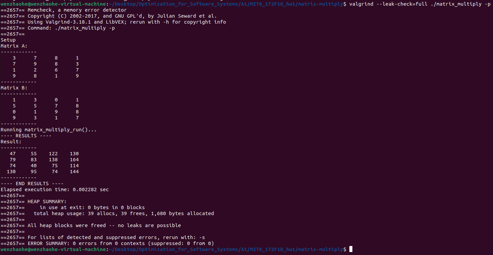

从以上结果可以看出，修改后的代码不存在内存泄漏问题了。
