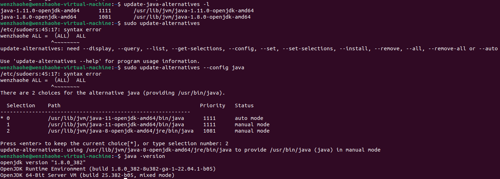
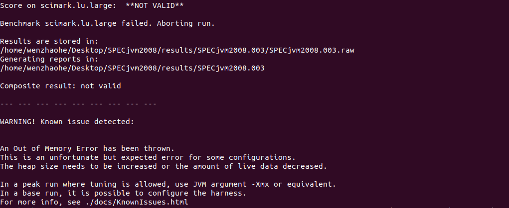
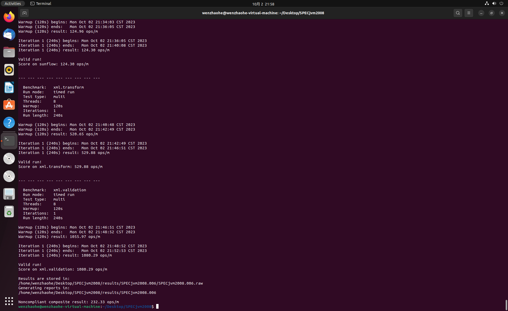
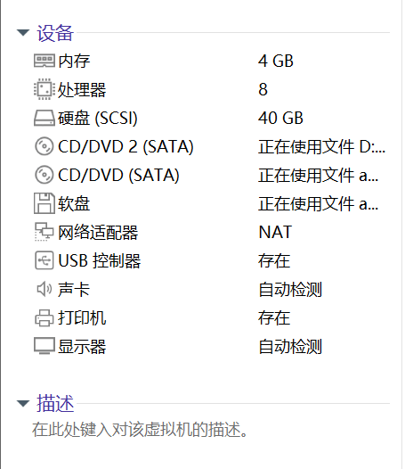

# 软件系统优化 实验报告2
温兆和 10205501432
## 安装JDK 8
首先，在虚拟机中安装JDK 8：

安装完成后，在可用的Java版本列表中选择JDK 8。选择后执行`java -version`，显示当前的Java版本是1.8.0：

至此，JDK 8安装完成。

## 安装SPECjvm2008
在[Specjvm2008的简单学习](https://blog.51cto.com/u_11529070/6132431)这篇文章中，我获知了安装SPECjvm2008的具体方法。首先，执行`wget https://spec.cs.miami.edu/downloads/osg/java/SPECjvm2008_1_01_setup.jar --no-check-certificate`命令，获取安装包，再执行`java -jar SPECjvm2008_1_01_setup.jar -i console`安装SPECjvm2008。

可就在我打算检验安装是否成功的时候发生了一些小插曲。我运行`./run-specjvm.sh startup.helloworld -ikv`命令，准备看看有没有输出，机器却报出了这样的错误：

我的确没有设置过JDK的路径，但是我的JDK 8是用`apt-get`命令安装的，安装时并不会配置本地路径。查阅资料后我发现Ubuntu上OpenJDK 8通常安装在`/usr/lib/jvm/java-8-openjdk-amd64/`。我检查了自己的机器，发现自己的JDK 8的确就是安装在这条路径下的。于是，我在`~/.bashrc`中配置了本地路径后再次运行`./run-specjvm.sh startup.helloworld -ikv`命令，得到

即表明SPECjvm2008已经安装成功。

## 运行SPECjvm2008
接着，就执行`java -jar SPECjvm2008.jar --base`命令运行SPECjvm2008的Base类别。但是运行过程中屡次出现了这样的问题：进程长时间地卡在`startup.compiler.sunflow`这里，不再执行下去了。

于是，我打开了实验手册中提供的几个SPECjvm2008官方网站上的文档，用Ctrl+F搜索`startup.compiler.sunflow`，终于在[FAQ](https://www.spec.org/jvm2008/docs/FAQ.html)中找到了一些对我有用的提示信息：

原来，是我安装的JDK 8让`startup.compiler.compiler`、`startup.compiler.sunflow`、`compiler.compiler`和`compiler.sunflow`这四个benchmark无法运行。根据下面的提示，我点开了[SPECjvm2008 User's Guide](https://www.spec.org/jvm2008/docs/UserGuide.html)页面，在”Running SPECjvm2008”这一部分看到，我在运行之前是可以指定运行哪些benchmark的。

此外，在这个页面的附录里，我还看到了所有benchmark的名单：

于是，我再次运行SPECjvm2008，并且在命令行中添加了以上benchmark中除了四个无法运行的benchmark之外所有benchmark的名称。

这一次，没有再次出现基准评测运行中卡死的情况，但当进程运行到`scimark.fft.large`时，内存爆了。

于是，我就根据提示，用`-Xmx`参数来增加SPECjvm2008运行时的堆内存大小。一开始，我执行`java -Xmx2g -jar SPECjvm2008.jar --base [the names of all benchmarks]`
来把运行时的堆内存设置为2GB，但是还是出现了内存爆掉的情况。最终，我把运行时的堆内存增加到了5GB，才跑完了一次完整的基准评测。

## 结果分析
我的结果是这样的：

我的虚拟机是一个8处理器的机器。

在官方发布的结果中，[一台40core、4chip的机器的基准评测结果](https://www.spec.org/jvm2008/results/res2015q3/jvm2008-20150823-00019.base/SPECjvm2008.base.html)如下图所示：

我们可以发现，这个人的运行结果中，每一个benchmark的每分钟操作数（ops/m）都比我多。这或许是因为他这台机器的处理器数量多于我，如果每一个处理器每分钟的操作数都差不多，那处理器更多的机器总的每分钟操作数就会更多。
我们再看[一台2core、1chip的机器的基准评测结果](https://www.spec.org/jvm2008/results/res2009q4/jvm2008-20091021-00007.peak/SPECjvm2008.peak.html)：

我们很容易发现，这台机器任何一个benchmark的每分钟操作数都比我的虚拟机要少得多。

另外还有一个事实就是，无论在以上三台机器的哪一台机器上，`scimark.large`的每分钟操作数都比`scimark.small`的每分钟操作数要少很多。可能的原因是，scimark.large占据的内存空间更大，所以它在执行的时候需要频繁地进行内存的换进换出，导致实际执行代码的时间相对更少。

## 总结和体会
在自己运行基准评测的过程中，我遇到了大大小小的问题，但最后都通过阅读SPECjvm2008的官网和网络上的博客顺利解决了。我感受到，通过这些年的学习和磨炼，自己独立发现问题、解决问题的能力在逐年提升。另外，这也是我第一次运行如此大型的程序，如果把迭代试错的时间也算进去，我总共跑了五六次基准评测（当然只有最后一次是成功的），花了我一个下午+一个晚上的时间，但也正是这样一个比较大的程序，才能让我们更加直观地体会到CPU和内存性能的差异对程序的运行速度有多么大的影响。
