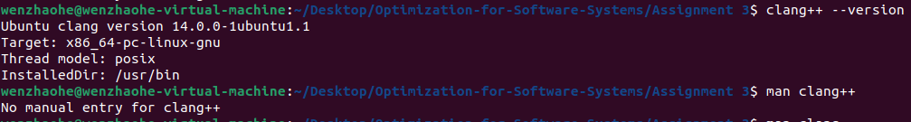
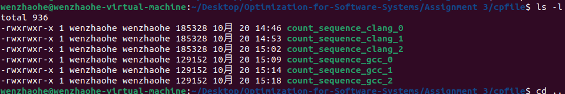
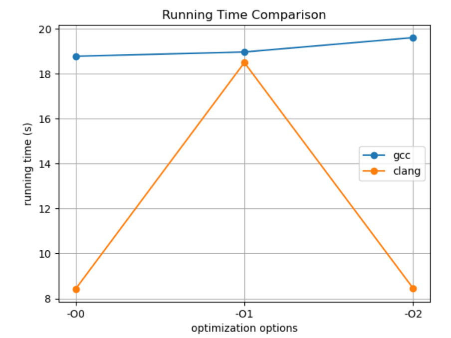

# 软件系统优化 实验报告3
温兆和 10205501432

## Write-up 1
**请解释一下为什么`clang --version`与`clang++ --version`的输出结果是一样的？**

在知乎问题[请问Clang和Clang++的区别是什么？](https://www.zhihu.com/question/464110189)中，[若梦](https://www.zhihu.com/people/ruomenger)的回答中说道，`clang`和`clang++`其实是完全相同的程序，`clang++`是`clang`的软链接之一，`clang`可编译C程序，`clang++`可编译C\+\+程序，`clang`要加上参数修改处理模式才能编译C\+\+程序。

还有一件很有意思的事情，就是我的虚拟机上明明可以查到`clang++`的版本，但当我执行`man clang++`的时候，它并没有像执行`man clang`时那样出现`clang++`的命令文档。这或许也说明，`clang`和`clang++`其实是同一个东西。



## Write-up 2
**请说明一下你选择了哪个测试例，以及你选择这个测试例的原因。**

我选择了`count_sequence.cpp`这个测试例，因为它排得比较靠前，一开始就被我看到了。而且这个测试用例里面做的事情本质上就是数数，不会有什么特别复杂的算法，代码也不算很长，才四百来行，运行的时间也不会太长。

## Write-up 3
**你对`makefile`及所选测试例对应的源文件做了哪些修改，为什么？**

我对`makefile`作了如下修改：
```C
……
#
# our target programs
#

BINARIES = count_sequence
……
report:  $(BINARIES)
	echo "##STARTING Version 1.0" > $(REPORT_FILE)
	date >> $(REPORT_FILE)
	echo "##CFlags: $(CFLAGS)" >> $(REPORT_FILE)
	echo "##CPPFlags: $(CPPFLAGS)" >> $(REPORT_FILE)
	./count_sequence >> $(REPORT_FILE)
	date >> $(REPORT_FILE)
	echo "##END Version 1.0" >> $(REPORT_FILE)
```
这样修改的目的是为了让`makefile`只3编译和运行`count_sequence.cpp`这个测试例。

测试例没有作任何改动，因为`int iterations = 400000`下的运行时间不算很长也不过于短，对本次实验来说刚好。

## Write-up 4
**请针对选定的测试例及收集到的6个测试数据结果文件（以及相应测试例编译后的代码大小），进行数据分析，总结分析洞见。要求：**
- **需要对不同组合下测试例的代码大小及运行性能进行分析；**
- **尽量用可视化的形式来呈现分析结果；**
- **分析洞见的总结尽量简明扼要，如有可能请加上对所总结洞见的合理解释。**

对于不同编译器和编译优化选项组合生成的可执行文件的大小，我们把实验过程中产生的六个可执行文件放在`./cpfile`，执行`ls -l`，得到



我们可以发现：
- 同一个编译器，编译优化选项不同，生成的可执行文件的大小没有什么区别；
- GCC编译器生成的可执行文件的大小比clang编译器生成的可执行文件的大小要大。

在上网参阅资料后我得知，某些情况下，GCC可能采用更激进的优化策略，导致生成的代码更小。

对于不同编译器和编译优化选项组合的运行时间，我们收集六种编译配置组合下代码运行后产生的报告，把所有报告移动到`./results`路径下，用报告最后一行中显示的运行时间在Python中绘制图表，我们得到

容易发现：
- 无论在何种编译优化选项下，GCC编译器生成的可执行文件的运行时间始终比clang编译器生成的要长；
- 如果是用GCC编译器生成的可执行文件，运行时间随着优化级别的提升而变长；
- 如果是用clang编译器生成的可执行文件，`-O1`优化级别生成的可执行文件的运行时间明显长于另外两个编译优化选项。

对于第一个结论，在阅读[详解三大编译器：gcc、llvm 和 clang](https://zhuanlan.zhihu.com/p/357803433)这篇文章后，我了解到，clang的编译时间（包括预处理、语法分析、解析、语义分析、抽象语法树生成的时间）比GCC的编译时间更短，甚至可以比GCC快两倍多，这和我们的实验结果也是符合的。可以看到，在`-O0`和`-O2`选项下，clang的运行时间只有八秒多，而GCC却要接近二十秒。

第二个结论是有些出乎我意料的，因为从`-O0`、`-O1`到`-O2`优化级别是更高的。我认为，优化级别越高运行时间越短，可能的原因是本次实验中使用的数组计数代码太简单了，没有什么太复杂的算法，导致更高优化级别的优势体现不出来。此外，优化级别越高，编译所花去的时间也可能越长。如果我们运行一个更复杂的算法，更高优化级别的优势或许才能体现出来。

但是我们也可以看到，在clang编译器中情况又不是这样。这也说明，即使是同一优化选项，不同的编译器的表现也是不同的。