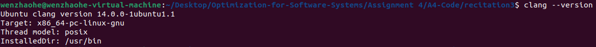
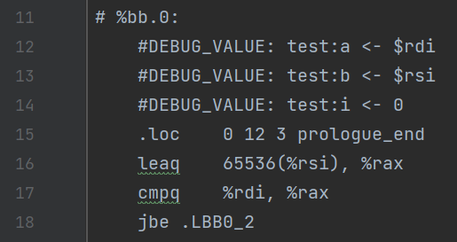
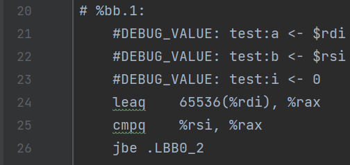
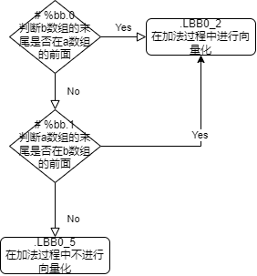
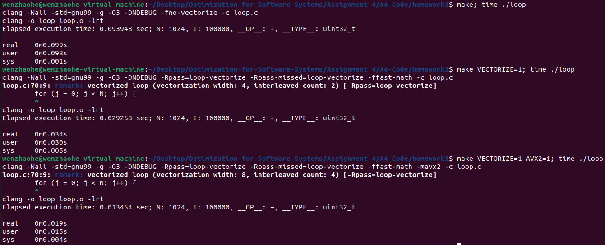
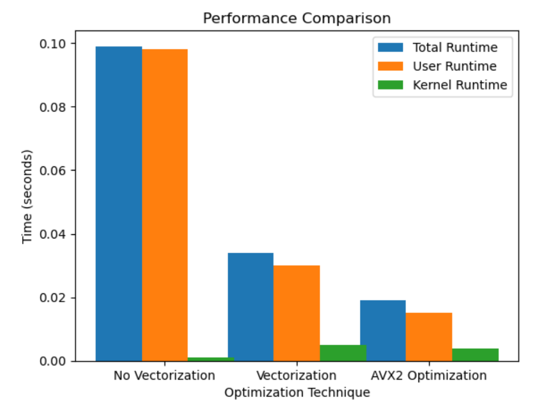
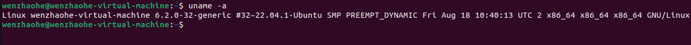

# 软件系统优化 实验报告4
温兆和 10205501432

## Write-up 1
**请同学们对照着`example1.c`仔细理解上一命令的输出文件`example1.s`，画出汇编代码的控制流图。同时比较一下你得到的`example1.s`跟下图中另一版本的编译器生成的`example1.s`有什么区别。详细说明你得到的 `example1.s`中`.LBB0_2`内向量化后代码的循环控制逻辑跟下图中`.LBB0_2`内向量化后代码的循环控制逻辑有何不同，阐述你对这两种代码生成方法各自优缺点的理解。(请同学们注明一下自己实验环境下的clang版本)**

我的clang版本是：



经过对源代码的阅读后，我发现这是一个对两个数组进行相加的函数。在执行实验手册中的命令后，我们得到了`example1.s`。接下来，让我们看看`example1.s`里面都有什么。
首先，判断`b`数组的末尾是否在`a`数组的开头的前面，如果是，就跳到`.LBB0_2`：



如果`b`数组的末尾在`s`数组开头的后面，那就判断`a`数组的末尾是否在`b`数组的开头的前面，如果是，就跳到`.LBB0_2`：



容易发现，上面的代码实际上就是在判断两个数组在内存中是否重合。如果不重合，从`.LBB0_2`开始，就进行向量化。代码会使用movdqu指令从b数组读取数据，然后使用paddb指令进行加法运算：
```assembly
.LBB0_2:
	#DEBUG_VALUE: test:a <- $rdi
	#DEBUG_VALUE: test:b <- $rsi
	#DEBUG_VALUE: test:i <- 0
	.loc	0 0 3                           # example1.c:0:3
	xorl	%eax, %eax
.Ltmp10:
	.p2align	4, 0x90
.LBB0_3:                                # =>This Inner Loop Header: Depth=1
	#DEBUG_VALUE: test:a <- $rdi
	#DEBUG_VALUE: test:b <- $rsi
	#DEBUG_VALUE: test:i <- 0
	.loc	0 13 13 is_stmt 1               # example1.c:13:13
	movdqu	(%rsi,%rax), %xmm0
	movdqu	16(%rsi,%rax), %xmm1
	.loc	0 13 10 is_stmt 0               # example1.c:13:10
	movdqu	(%rdi,%rax), %xmm2
	paddb	%xmm0, %xmm2
	movdqu	16(%rdi,%rax), %xmm0
	paddb	%xmm1, %xmm0
	movdqu	32(%rdi,%rax), %xmm1
	movdqu	48(%rdi,%rax), %xmm3
	movdqu	%xmm2, (%rdi,%rax)
	movdqu	%xmm0, 16(%rdi,%rax)
	.loc	0 13 13                         # example1.c:13:13
	movdqu	32(%rsi,%rax), %xmm0
	.loc	0 13 10                         # example1.c:13:10
	paddb	%xmm1, %xmm0
	.loc	0 13 13                         # example1.c:13:13
	movdqu	48(%rsi,%rax), %xmm1
	.loc	0 13 10                         # example1.c:13:10
	paddb	%xmm3, %xmm1
	movdqu	%xmm0, 32(%rdi,%rax)
	movdqu	%xmm1, 48(%rdi,%rax)
.Ltmp11:
	.loc	0 12 26 is_stmt 1               # example1.c:12:26
	addq	$64, %rax
	cmpq	$65536, %rax                    # imm = 0x10000
	jne	.LBB0_3
.Ltmp12:
.LBB0_6:
	#DEBUG_VALUE: test:a <- $rdi
	#DEBUG_VALUE: test:b <- $rsi
	.loc	0 15 1                          # example1.c:15:1
	retq
```
否则，就继续执行`.LBB0_5`下面的汇编指令，不进行向量化，而是逐个处理`b`数组中的字节，将其加到`a`数组相应位置的字节上：
```assemble
.LBB0_5:                                # =>This Inner Loop Header: Depth=1
	#DEBUG_VALUE: test:a <- $rdi
	#DEBUG_VALUE: test:b <- $rsi
	#DEBUG_VALUE: test:i <- $rax
	.loc	0 13 13 is_stmt 1               # example1.c:13:13
	movzbl	(%rsi,%rax), %ecx
	.loc	0 13 10 is_stmt 0               # example1.c:13:10
	addb	%cl, (%rdi,%rax)
.Ltmp3:
	#DEBUG_VALUE: test:i <- [DW_OP_constu 1, DW_OP_or, DW_OP_stack_value] $rax
	#DEBUG_VALUE: test:i <- [DW_OP_constu 1, DW_OP_or, DW_OP_stack_value] $rax
	.loc	0 13 13                         # example1.c:13:13
	movzbl	1(%rsi,%rax), %ecx
	.loc	0 13 10                         # example1.c:13:10
	addb	%cl, 1(%rdi,%rax)
.Ltmp4:
	#DEBUG_VALUE: test:i <- [DW_OP_constu 2, DW_OP_or, DW_OP_stack_value] $rax
	#DEBUG_VALUE: test:i <- [DW_OP_constu 2, DW_OP_or, DW_OP_stack_value] $rax
	.loc	0 13 13                         # example1.c:13:13
	movzbl	2(%rsi,%rax), %ecx
	.loc	0 13 10                         # example1.c:13:10
	addb	%cl, 2(%rdi,%rax)
.Ltmp5:
	#DEBUG_VALUE: test:i <- [DW_OP_constu 3, DW_OP_or, DW_OP_stack_value] $rax
	#DEBUG_VALUE: test:i <- [DW_OP_constu 3, DW_OP_or, DW_OP_stack_value] $rax
	.loc	0 13 13                         # example1.c:13:13
	movzbl	3(%rsi,%rax), %ecx
	.loc	0 13 10                         # example1.c:13:10
	addb	%cl, 3(%rdi,%rax)
.Ltmp6:
	.loc	0 12 26 is_stmt 1               # example1.c:12:26
	addq	$4, %rax
.Ltmp7:
	#DEBUG_VALUE: test:i <- $rax
	.loc	0 12 17 is_stmt 0               # example1.c:12:17
	cmpq	$65536, %rax                    # imm = 0x10000
.Ltmp8:
	.loc	0 12 3                          # example1.c:12:3
	jne	.LBB0_5
	jmp	.LBB0_6
.Ltmp9:
```
所以，该汇编代码的控制流图如下图所示：



仔细观察我的机器上生成的汇编代码和实验手册中的汇编代码后，我发现最大的区别在于，我的机器上`movdqu`指令后面跟着的都是16的倍数，比如`movdqu	16(%rdi,%rax), %xmm0`，而实验手册上的汇编代码的`movdqu`指令后的数字都是一个六万多的数字，如`movdqu 65536(%rsi,%rax), %xmmo`。我推测，这可能是由于第一段代码在向量化时是把数组分成几组进行向量化的，而第二段代码是对整个数组进行了向量化（因为两个数组的长度都是65536）。此外，第一段代码向量化的单位可能会比第二段代码要大。具体哪种方案更好，还要考虑指令集架构中寄存器的宽度和数据访问模式。

## Write-up 2
**请同学们仔细理解这个命令所产生的新的输出文件`example1.s`与Write-up1中所分析的`example1.s`有何区别，简单阐述为何会有这个区别。**

按实验手册要求修改代码并执行编译命令后，得到如下汇编代码（部分）：
```assemble
.text
	.file	"example1.c"
	.globl	test                            # -- Begin function test
	.p2align	4, 0x90
	.type	test,@function
test:                                   # @test
.Lfunc_begin0:
	.file	0 "/home/wenzhaohe/Desktop/Optimization-for-Software-Systems/Assignment 4/A4-Code/recitation3" "example1.c" md5 0x094e920f5f12746d7cc7ddf73cde262d
	.loc	0 9 0                           # example1.c:9:0
	.cfi_startproc
# %bb.0:
	#DEBUG_VALUE: test:a <- $rdi
	#DEBUG_VALUE: test:b <- $rsi
	xorl	%eax, %eax
.Ltmp0:
	#DEBUG_VALUE: test:i <- 0
	.p2align	4, 0x90
.LBB0_1:                                # =>This Inner Loop Header: Depth=1
	#DEBUG_VALUE: test:a <- $rdi
	#DEBUG_VALUE: test:b <- $rsi
	#DEBUG_VALUE: test:i <- 0
	.loc	0 13 13 prologue_end            # example1.c:13:13
	movdqu	(%rsi,%rax), %xmm0
	movdqu	16(%rsi,%rax), %xmm1
	.loc	0 13 10 is_stmt 0               # example1.c:13:10
	movdqu	(%rdi,%rax), %xmm2
	paddb	%xmm0, %xmm2
	movdqu	16(%rdi,%rax), %xmm0
	paddb	%xmm1, %xmm0
	movdqu	32(%rdi,%rax), %xmm1
	movdqu	48(%rdi,%rax), %xmm3
	movdqu	%xmm2, (%rdi,%rax)
	movdqu	%xmm0, 16(%rdi,%rax)
	.loc	0 13 13                         # example1.c:13:13
	movdqu	32(%rsi,%rax), %xmm0
	.loc	0 13 10                         # example1.c:13:10
	paddb	%xmm1, %xmm0
	.loc	0 13 13                         # example1.c:13:13
	movdqu	48(%rsi,%rax), %xmm1
	.loc	0 13 10                         # example1.c:13:10
	paddb	%xmm3, %xmm1
	movdqu	%xmm0, 32(%rdi,%rax)
	movdqu	%xmm1, 48(%rdi,%rax)
.Ltmp1:
	.loc	0 12 26 is_stmt 1               # example1.c:12:26
	addq	$64, %rax
	cmpq	$65536, %rax                    # imm = 0x10000
	jne	.LBB0_1
.Ltmp2:
# %bb.2:
	#DEBUG_VALUE: test:a <- $rdi
	#DEBUG_VALUE: test:b <- $rsi
	#DEBUG_VALUE: test:i <- 0
	.loc	0 15 1                          # example1.c:15:1
	retq
    ……
```
容易发现，上面的汇编代码不再判断数组`a`和数组`b`是否重合，而加法运算的汇编代码和修改前”进行向量化“的那部分汇编代码一模一样。这是因为添加`restrict`关键字会告诉编译器指针`a`和`b`不会重叠。这将会使两个数组各自访问，互不干扰。

## Write-up 3 <a name="writeup3"></a>
**请同学们仔细理解这个命令所产生的新的输出文件`example1.s`与Write-up2中所分析的`example1.s`有何区别，简单阐述为何会有这个区别。**

按实验手册要求修改代码并执行编译命令后，汇编代码又发生了一些变化。在`.LBB0_1`中，`movdqu`不见了，但是有很多`movdqa`指令：
```assemble
.LBB0_1:                                # =>This Inner Loop Header: Depth=1
	#DEBUG_VALUE: test:a <- $rdi
	#DEBUG_VALUE: test:b <- $rsi
	#DEBUG_VALUE: test:i <- 0
	.loc	0 16 10 prologue_end            # example1.c:16:10
	movdqa	(%rdi,%rax), %xmm0
	movdqa	16(%rdi,%rax), %xmm1
	movdqa	32(%rdi,%rax), %xmm2
	movdqa	48(%rdi,%rax), %xmm3
	paddb	(%rsi,%rax), %xmm0
	paddb	16(%rsi,%rax), %xmm1
	movdqa	%xmm0, (%rdi,%rax)
	movdqa	%xmm1, 16(%rdi,%rax)
	paddb	32(%rsi,%rax), %xmm2
	paddb	48(%rsi,%rax), %xmm3
	movdqa	%xmm2, 32(%rdi,%rax)
	movdqa	%xmm3, 48(%rdi,%rax)
```
这是因为我们用`__builtin_assume_aligned`表明了指针的对齐性。这一系列的`movdqa`指令用于将`a`数组中的数据加载到XMM寄存器中，这是一种对齐的128位加载指令，适用于对齐的数据。

## Write-up 4 <a name="writeup4"></a>
**请同学们仔细理解这个命令所产生的新的输出文件`example1.s`与Write-up3中所分析的`example1.s`有何区别，简单阐述为何会有这个区别。为使编译器生成对齐内存访问的`AVX2`指令，应该对`example1.c`再做何修改？请附上修改后的代码。**

按实验手册要求修改代码并执行编译命令后，汇编代码又发生了一些变化。这一次，由于使用了AVX2指令集进行向量化，汇编代码中出现了一些AVX2指令集中的指令，如`vmovdqu`和`vpaddb`：
```assemble
.LBB0_1:                                # =>This Inner Loop Header: Depth=1
	#DEBUG_VALUE: test:a <- $rdi
	#DEBUG_VALUE: test:b <- $rsi
	#DEBUG_VALUE: test:i <- 0
	.loc	0 16 10 prologue_end            # example1.c:16:10
	vmovdqu	(%rdi,%rax), %ymm0
	vmovdqu	32(%rdi,%rax), %ymm1
	vmovdqu	64(%rdi,%rax), %ymm2
	vmovdqu	96(%rdi,%rax), %ymm3
	vpaddb	(%rsi,%rax), %ymm0, %ymm0
	vpaddb	32(%rsi,%rax), %ymm1, %ymm1
	vpaddb	64(%rsi,%rax), %ymm2, %ymm2
	vpaddb	96(%rsi,%rax), %ymm3, %ymm3
	vmovdqu	%ymm0, (%rdi,%rax)
	vmovdqu	%ymm1, 32(%rdi,%rax)
	vmovdqu	%ymm2, 64(%rdi,%rax)
	vmovdqu	%ymm3, 96(%rdi,%rax)
```
通过查阅资料得知，`vpaddb`指令用于将两个256位的寄存器中的相应元素进行字节级别的加法运算，而`vmovdqu`指令被用来加载和存储256位的无序整数。可以看出，在AVX2指令集中，向量化的单位是256位而不是128位。又`uint8_t`表示8位的无符号整数，向量化应该是以$256/8=32$为单位的。因此，修改后的代码如下所示：
```c
#include <stdint.h>
#include <stdlib.h>
#include <math.h>

#define SIZE (1L << 16)

void test(uint8_t * restrict a,  uint8_t * restrict b) {
  uint64_t i;

  a = __builtin_assume_aligned(a, 32);
  b = __builtin_assume_aligned(b, 32);

  for (i = 0; i < SIZE; i++) {
    a[i] += b[i];
  }
}
```

## Write-up 5
**请认真比较`example2.s`和`example2.s.ORG`，尝试解释一下为什么新的`examplse2.s`含有比较高效的向量化代码。**

修改前的代码得到的汇编文件中，没有看出明显的向量化过程：
```assemble
.LBB0_1:                                # =>This Inner Loop Header: Depth=1
	#DEBUG_VALUE: test:a <- $rdi
	#DEBUG_VALUE: test:b <- $rsi
	#DEBUG_VALUE: test:x <- $rdi
	#DEBUG_VALUE: test:y <- $rsi
	#DEBUG_VALUE: test:i <- 0
	.loc	0 17 9                          # example2.c:17:9
	movq	(%rsi,%rax), %xmm1              # xmm1 = mem[0],zero
	.loc	0 17 16 is_stmt 0               # example2.c:17:16
	movq	(%rdi,%rax), %xmm3              # xmm3 = mem[0],zero
	.loc	0 17 14                         # example2.c:17:14
	pminub	%xmm1, %xmm3
	pcmpeqb	%xmm1, %xmm3
	movd	%xmm3, %ecx
	notb	%cl
.Ltmp3:
	.loc	0 15 26 is_stmt 1               # example2.c:15:26
	testb	$1, %cl
	je	.LBB0_3
```
而修改后的代码生成的汇编代码中就能看出一些向量化的指令：
```assemble
.LBB0_1:                                # =>This Inner Loop Header: Depth=1
	#DEBUG_VALUE: test:a <- $rdi
	#DEBUG_VALUE: test:b <- $rsi
	#DEBUG_VALUE: test:x <- $rdi
	#DEBUG_VALUE: test:y <- $rsi
	#DEBUG_VALUE: test:i <- 0
	.loc	0 18 13 prologue_end            # example2.c:18:13
	movdqa	(%rsi,%rax), %xmm0
	movdqa	16(%rsi,%rax), %xmm1
	.loc	0 18 12 is_stmt 0               # example2.c:18:12
	pmaxub	(%rdi,%rax), %xmm0
	pmaxub	16(%rdi,%rax), %xmm1
	.loc	0 18 10                         # example2.c:18:10
	movdqa	%xmm0, (%rdi,%rax)
	movdqa	%xmm1, 16(%rdi,%rax)
	.loc	0 18 13                         # example2.c:18:13
	movdqa	32(%rsi,%rax), %xmm0
	movdqa	48(%rsi,%rax), %xmm1
	.loc	0 18 12                         # example2.c:18:12
	pmaxub	32(%rdi,%rax), %xmm0
	pmaxub	48(%rdi,%rax), %xmm1
	.loc	0 18 10                         # example2.c:18:10
	movdqa	%xmm0, 32(%rdi,%rax)
	movdqa	%xmm1, 48(%rdi,%rax)
```
究其原因，可能是因为原始的`if`语句可能导致分支，而分支可能会影响编译器的向量化优化。而三目运算符更加紧凑，没有显式的分支语句，这样编译器更容易进行向量化优化。编译器可以更容易地识别代码中的模式，从而生成更有效的SIMD指令序列。

## Write-up 6
**请认真理解`example3.s`，尝试解释一下为什么`examplse3.s`中没有出现向量化指令。编译器对这个循环进行向量化优化是否可以生成更加高性能的代码？为什么？**

在这段代码中，数组`a`的第$i$个元素被赋值为数组`b`的第$i+1$个元素，这种错位的访问可能导致在向量寄存器中加载`b[i+1]`时无法直接使用前一次加载的`b[i]`的值，而向量化通常依赖于数据的连续存储和访问模式，以便一次加载多个数据元素到矢量寄存器中。所以，在这种情况下，进行向量化难以生成性能更好的代码。

## Write-up 7
**请比较`example4.s.ORG`和`example4.s`中跟`test`函数对应的汇编代码，解释这两个版本中汇编代码的差别，并解释导致这个差别的原因？**

添加添加`-ffast-math`编译标志前生成的部分汇编代码如下所示：
```assemble
.LBB0_1:                                # =>This Inner Loop Header: Depth=1
	#DEBUG_VALUE: test:a <- $rdi
	#DEBUG_VALUE: test:x <- $rdi
	#DEBUG_VALUE: test:y <- $xmm0
	#DEBUG_VALUE: test:i <- $rax
	.loc	0 18 7 prologue_end             # example4.c:18:7
	addsd	(%rdi,%rax,8), %xmm0
.Ltmp1:
	#DEBUG_VALUE: test:y <- $xmm0
	#DEBUG_VALUE: test:y <- $xmm0
	#DEBUG_VALUE: test:i <- [DW_OP_constu 1, DW_OP_or, DW_OP_stack_value] $rax
	#DEBUG_VALUE: test:i <- [DW_OP_constu 1, DW_OP_or, DW_OP_stack_value] $rax
	addsd	8(%rdi,%rax,8), %xmm0
.Ltmp2:
	#DEBUG_VALUE: test:y <- $xmm0
	#DEBUG_VALUE: test:y <- $xmm0
	#DEBUG_VALUE: test:i <- [DW_OP_constu 2, DW_OP_or, DW_OP_stack_value] $rax
	#DEBUG_VALUE: test:i <- [DW_OP_constu 2, DW_OP_or, DW_OP_stack_value] $rax
	addsd	16(%rdi,%rax,8), %xmm0
.Ltmp3:
	#DEBUG_VALUE: test:y <- $xmm0
	#DEBUG_VALUE: test:y <- $xmm0
	#DEBUG_VALUE: test:i <- [DW_OP_constu 3, DW_OP_or, DW_OP_stack_value] $rax
	#DEBUG_VALUE: test:i <- [DW_OP_constu 3, DW_OP_or, DW_OP_stack_value] $rax
	addsd	24(%rdi,%rax,8), %xmm0
.Ltmp4:
	#DEBUG_VALUE: test:y <- $xmm0
	#DEBUG_VALUE: test:y <- $xmm0
	#DEBUG_VALUE: test:i <- [DW_OP_constu 4, DW_OP_or, DW_OP_stack_value] $rax
	#DEBUG_VALUE: test:i <- [DW_OP_constu 4, DW_OP_or, DW_OP_stack_value] $rax
	addsd	32(%rdi,%rax,8), %xmm0
.Ltmp5:
	#DEBUG_VALUE: test:y <- $xmm0
	#DEBUG_VALUE: test:y <- $xmm0
	#DEBUG_VALUE: test:i <- [DW_OP_constu 5, DW_OP_or, DW_OP_stack_value] $rax
	#DEBUG_VALUE: test:i <- [DW_OP_constu 5, DW_OP_or, DW_OP_stack_value] $rax
	addsd	40(%rdi,%rax,8), %xmm0
.Ltmp6:
	#DEBUG_VALUE: test:y <- $xmm0
	#DEBUG_VALUE: test:y <- $xmm0
	#DEBUG_VALUE: test:i <- [DW_OP_constu 6, DW_OP_or, DW_OP_stack_value] $rax
	#DEBUG_VALUE: test:i <- [DW_OP_constu 6, DW_OP_or, DW_OP_stack_value] $rax
	addsd	48(%rdi,%rax,8), %xmm0
.Ltmp7:
	#DEBUG_VALUE: test:y <- $xmm0
	#DEBUG_VALUE: test:y <- $xmm0
	#DEBUG_VALUE: test:i <- [DW_OP_constu 7, DW_OP_or, DW_OP_stack_value] $rax
	#DEBUG_VALUE: test:i <- [DW_OP_constu 7, DW_OP_or, DW_OP_stack_value] $rax
	addsd	56(%rdi,%rax,8), %xmm0
.Ltmp8:
	#DEBUG_VALUE: test:y <- $xmm0
	.loc	0 17 26                         # example4.c:17:26
	addq	$8, %rax
.Ltmp9:
	#DEBUG_VALUE: test:i <- $rax
	.loc	0 17 17 is_stmt 0               # example4.c:17:17
	cmpq	$65536, %rax                    # imm = 0x10000
.Ltmp10:
	.loc	0 17 3                          # example4.c:17:3
	jne	.LBB0_1
```
添加添加`-ffast-math`编译标志后生成的部分汇编代码如下所示：
```assemble
.LBB0_1:                                # =>This Inner Loop Header: Depth=1
	#DEBUG_VALUE: test:a <- $rdi
	#DEBUG_VALUE: test:x <- $rdi
	#DEBUG_VALUE: test:y <- 0.000000e+00
	#DEBUG_VALUE: test:i <- 0
	.loc	0 18 7 prologue_end             # example4.c:18:7
	addpd	(%rdi,%rax,8), %xmm0
	addpd	16(%rdi,%rax,8), %xmm1
	addpd	32(%rdi,%rax,8), %xmm0
	addpd	48(%rdi,%rax,8), %xmm1
	addpd	64(%rdi,%rax,8), %xmm0
	addpd	80(%rdi,%rax,8), %xmm1
	addpd	96(%rdi,%rax,8), %xmm0
	addpd	112(%rdi,%rax,8), %xmm1
.Ltmp2:
	.loc	0 17 26                         # example4.c:17:26
	addq	$16, %rax
	cmpq	$65536, %rax                    # imm = 0x10000
	jne	.LBB0_1
```
容易发现，在没有使用`-ffast-math`的版本中，每次迭代使用单精度浮点数加法指令`addsd`。而在使用`-ffast-math`的版本中，每次迭代使用双精度浮点数加法指令`addpd`。这是因为`-ffast-math`允许编译器使用更宽的浮点数寄存器以提高性能。

## Write-up 8
**设计一个实验方案，最后用图示化的形式科学地比较上述三种情况下生成代码的性能，并尝试去解释性能提升的原因。请注意实验结果的描述需要包含对你的实验平台的描述，而且性能提升的解释也需要结合你的实验平台特点。**

运行三种优化情况下的测试代码，得到的结果是：



绘制图表：



我们可以发现，相比于没有优化的情况，进行向量化之后，运行时间少了一半还要多；使用AVX2指令进行向量化之后，运行时间又比不用AVX2指令进行向量化要少一半。我的机器是一个64位的机器：



结合之前的实验过程，我们知道不用AVX2指令，向量化是以128位为单位的（[Write-up 3](#writeup3)），而使用AVX2指令后向量化是以256位为单位的（[Write-up 4](#writeup4)）。这也就解释了为什么向量化之后性能比不进行向量化好一倍，而使用AVX2指令后性能又比不用AVX2指令进行向量化好一倍。