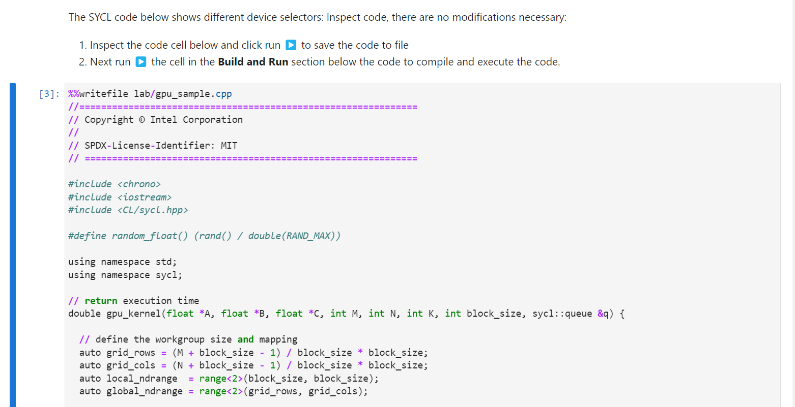
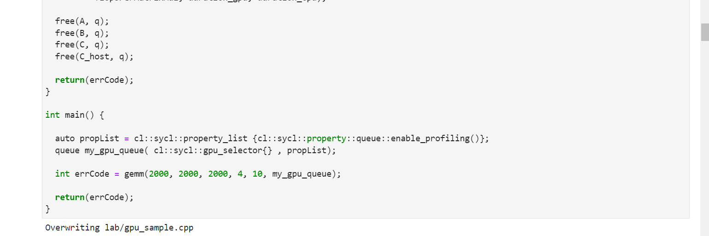
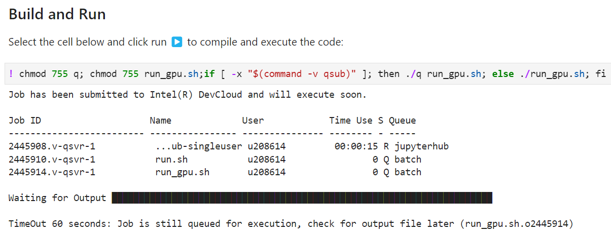
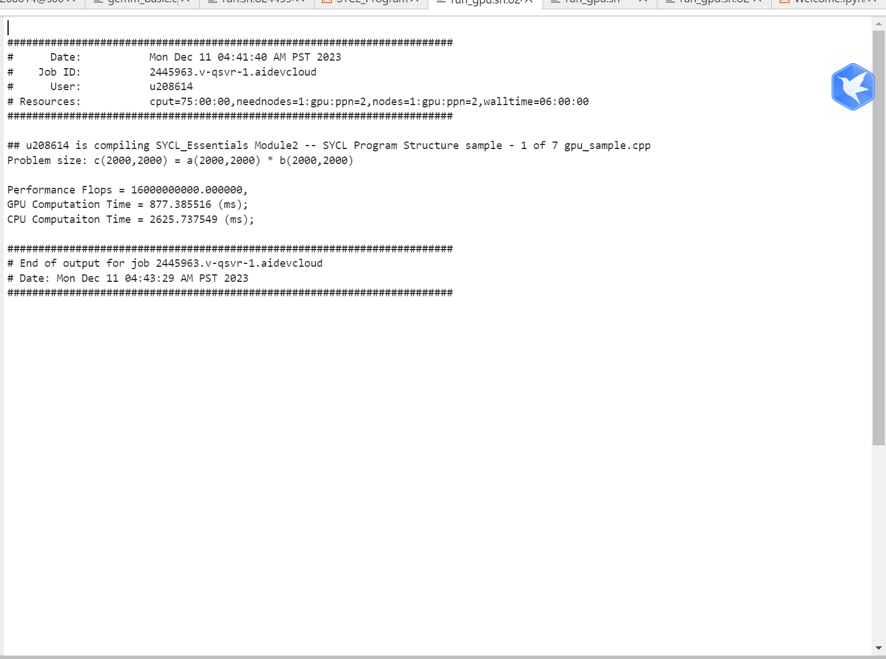

# 软件系统优化 实验报告5
温兆和 10205501432

## Step 1
**改写`gemm_basic`代码26，27行，利用`work group`和`local work item`的坐标来计算`global`坐标。**

在SYCL中，可以使用`get_local_id(dim)`获取本地工作项的坐标，使用`get_group(dim)`获取工作组的坐标。为了在内核中通过工作组和本地工作项的坐标计算全局坐标，我们把这两行代码改成这样：
```C
int row = index.get_local_id(0)+index.get_group(0)*block_size;
int col = index.get_local_id(1)+index.get_group(1)*block_size;
```

## Step 2
**修改程序输入数据的大小，设定`M=N=K=2000`，修改程序，并使其通过正确性测试。**

先修改代码：
```C
int main() {
  ……
  int errCode = gemm(2000, 2000, 2000, 4, 10, my_gpu_queue);

  return(errCode);
}
```
在做实验的时候发现DevCloud有许多现成的OneAPI异构编程的例子。参考[Intel® DevCloud for oneAPI SYCL编程项目实践](https://blog.csdn.net/m0_63222058/article/details/134373146)，我们直接使用`~/oneAPI_Essentials/02_SYCL_Program_Structure`来运行我们的代码。打开`SYCL_Program_Structure.ipynb`文件，在第一个cell中按照提示复制黏贴`gemm_basic.cpp`中的代码：



运行这个cell，代码内容就被复制到`lab/gpu_sample.cpp`当中去了：



紧接着，运行第二个cell，编译并运行代码：



等待一段时间，结果如下：



可以看到，代码顺利地通过了正确性测试。