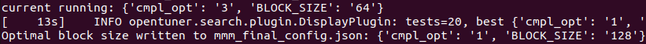
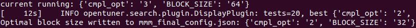

# 软件系统优化 项目报告1
温兆和 10205501432

## 实验目的和要求
在本次实验中，我们需要实现一个程序性能的自动调优器Autotuner，通过两种算法（其中一种是GridSearch）找到矩阵乘法的最优配置组合，从而体会不同的参数配置对程序性能的影响。

## 实验过程
### 自动化测试程序的实现
为了节省时间，我们直接基于OpenTuner框架实现这个性能调优器。

首先，我们需要实现一个自动化测试程序，它可以测试`./opentuner_master/multimatri.c`在不同配置组合下的性能，并找出最优性能。我们可以仿照[Tutorial: Optimizing Block Matrix Multiplication](https://opentuner.org/tutorial/gettingstarted/)中的例子（存放在`./opentuner_master/examples/tutorials/mmm_tuner.py`）写一个autotuner，存放在`./opentuner_master/autotuner.py`中。

在`GccFlagsTuner`类的`manipulator`方法中定义矩阵乘法程序的待测配置空间。本次实验中，待测的配置空间是：
- 循环分块大小：8、16、32、64、128
- 编译优化级别：`-O0`、`-O1`、`-O2`、`-O3`

```Python
    def manipulator(self):
        """
        Define the search space by creating a
        ConfigurationManipulator
        """
        manipulator = ConfigurationManipulator()
        manipulator.add_parameter(
            IntegerParameter('cmpl_opt', 0, 3))
        manipulator.add_parameter(
            EnumParameter('BLOCK_SIZE', [8, 16, 32, 64, 128]))
        return manipulator
```
`GccFlagsTuner`类的`run`方法会在给定的参数配置下运行自动调优器，并返回各个配置组合下的性能。和`mmm_tuner.py`一样，这个性能调优器中对于不同参数配置的选择也体现在编译命令中。
```Python
    def run(self, desired_result, input, limit):
        """
        Compile and run a given configuration then
        return performance
        """
        cfg = desired_result.configuration.data

        gcc_cmd = 'gcc multimatri.c '
        gcc_cmd += ' -D{0}={1}'.format('BLOCK_SIZE', cfg['BLOCK_SIZE'])
        gcc_cmd += ' -O{0}'.format(cfg['cmpl_opt'])
        gcc_cmd += ' -o ./tmp.bin'

        compile_result = self.call_program(gcc_cmd)

        run_cmd = './tmp.bin'

        run_result = self.call_program(run_cmd)

        return Result(time=run_result['time'])
```
`GccFlagsTuner`类的`save_final_config`方法会打印找到的最佳配置，并将其存储在`mmm_final_config.json`文件中。
```Python
    def save_final_config(self, configuration):
        """called at the end of tuning"""
        print("Optimal block size written to mmm_final_config.json:", configuration.data)
        self.manipulator().save_to_file(configuration.data,
                                        'mmm_final_config.json')
```
在配置调优程序的实现中需要注意一点：在参考`mmm_tuner.py`时，最好把类似`assert run_result['returncode'] == 0`这样带有`assert`语句的行删掉。这些语句会在编译命令返回非零值或者代码的返回非零码的时候报出`AssertionError`。事实上，我并不清楚程序（或者编译器）在这个时候是否应该返回零。为了避免不必要的麻烦，我们干脆把这两行带有`assert`的代码删掉。否则，就会在运行`autotuner.py`时报出如下错误：


### GridSearch算法的实现
仅仅有测试程序是不够的，我们还需要有相应的算法来找到最优配置。我们实现的第一个最优配置搜索算法是GridSearch，它的基本思想就是遍历每一种配置组合，比较每一种配置组合的性能，从而得到性能最优的配置组合。GridSearch算法的代码被保存在`./opentuner_master/opentuner/search/GridSearch.py`中。

参照[Creating OpenTuner Techniques](https://opentuner.org/tutorial/techniques/)的指导，我们首先要定义一个`GridSearch`类，并在全局列表中注册它。
```Python
class GridSearch(technique.SequentialSearchTechnique):
  def main_generator(self):

    ......

technique.register(GridSearch())
```
接下来大部分的工作都是在`main_generator`这个函数中完成的。这是`SequentialSearchTechnique`模型的核心函数，会生成`opentuner.resultsdb.models.Configuration`对象并且在生成配置后阻塞，直到生成相应配置的结果。

首先，我们引入几个比较重要的对象。它们分别是：
- `objective`：`objective`对象用于比较不同配置的性能，使用用户定义的质量度量标准。通常，它是MinimizeTime()的一个实例，只关注配置组合的运行时间；
- `driver`：与结果数据库进行交互；
- `manipulator`：允许该技术进行更改和检查配置，实际上是一个参数对象的列表。

```Python
	objective   = self.objective
	driver      = self.driver
	manipulator = self.manipulator
```
接着，定义配置空间：
```Python
	# Define the parameter value ranges
	cmpl_opt_values = [0, 1, 2, 3]
	block_size_values = [8, 16, 32, 64, 128]
```
在下面的`for`循环中，遍历所有的配置组合，并使用`yield config`语句使之生效。遍历完成后，停止迭代，用`sys.exit()`退出循环。
```Python
   # Iterate through all parameter combinations
        for cmpl_opt in cmpl_opt_values:
            for block_size in block_size_values:
                config_data = {
                    'cmpl_opt': cmpl_opt,
                    'BLOCK_SIZE': block_size
                }
                config = driver.get_configuration(config_data)
                yield config

        # Signal the end of the search
        sys.exit()
```
运行`python3 autotuner.py --no-dups --stop-after=30 -t=GridSearch --test-limit=20`命令，用GridSearch对矩阵乘法进行性能调优。我们得到了如下结果：







我们可以发现，在这几次实验中，除了前面的两三次，配置组合中的“块大小”基本就固定在64，前面几次试验也极少出现块大小很大的情况，而编译优化级别跟最终的性能倒是没有体现出很强的相关性。“块大小”是什么？我们仔细阅读这个矩阵乘法的代码，就能发现这个代码是把原来的矩阵分块，分成多个s*s的小矩阵，再分别进行矩阵乘法运算。
```C
for (int ih = 0; ih < n; ih += s)
        for (int jh = 0; jh < n; jh += s)
            for (int kh = 0; kh < n; kh += s)
                for (int il = 0; il < s; ++il)
                    for (int kl = 0; kl < s; ++kl)
                        for (int jl = 0; jl < s; ++jl)
                            C[ih+il][jh+jl] += A[ih+il][kh+kl] * B[kh+kl][jh+jl];
```
从存储器结构的角度来看，这个块大小不宜过大。如果块大小比较小，那么数据的局部性更强，且整个矩阵分块都能被加载进内存。反之，如果分块大小过大，那么就无法将整个矩阵分块缓存，这将导致频繁的内存换进换出，从而影响程序的性能。

### One-Factor-at-a-Time算法实现
接下来，我们还要实现一个课上讲过的配置调优算法。为了节省时间，我只实现了比较简单的One-Factor-at-a-Time算法。顾名思义，One-Factor-at-a-Time算法就是一次先固定一个变量，改变另一个变量，并找到另一个变量中性能最好的那个；随后，把之前改变的变量的值设置为前一次找到的性能最优值，再去调整别的变量。

举例来说，在本次实验中，我们可以先固定编译优化选项是`-O0`，看看物种块大小里哪一个性能最好；我发现块大小为32性能最好，就把块大小固定为32，去尝试不同的编译优化选项，找到其中性能最好的编译优化选项。

下面简要介绍一下One-Factor-at-a-Time算法的代码。这个代码中有两个循环，第一个循环就是固定编译优化选项为`-O0`，寻找性能最优的块大小。
```Python
 block_sizes_tested = set()

        while True:
            points0 = list()
            if int(current.data['BLOCK_SIZE'])>=128:
                break;
            for param in manipulator.parameters(current.data):
                if param.is_primitive():
                    print("current running:", current.data)
                    current_block_size = int(current.data['BLOCK_SIZE'])
                    if current_block_size not in block_sizes_tested:
                            block_sizes_tested.add(current_block_size)
                            next_para = manipulator.copy(current.data)
                            next_BLOCK_SIZE = current_block_size * 2
                            next_para['BLOCK_SIZE'] = str(next_BLOCK_SIZE)
                            next_to_run = driver.get_configuration(next_para)
                            yield next_to_run
                            points0.append(next_to_run)
                    else:
                        print("Block size already tested:", current_block_size)
                        points0.append(current)

            # sort points
            points0.sort(key=cmp_to_key(objective.compare))
            current = points0[0]
            if objective.lt(points0[0], best_opt):
                best_opt = points0[0]
```
第一个循环中找到的最优块大小被保存在`best_block_size`中。
```Python         
        # Now start the second loop with the best_block_size fixed
        best_block_size = best_opt.data['BLOCK_SIZE']
```
然后，在第二个循环中，我们就把块大小固定为`best_block_size`，遍历所有的编译优化选项并找出其中性能最优者。
```Python
startpoint = {'BLOCK_SIZE': best_block_size, 'cmpl_opt': 0}
        current = driver.get_configuration(startpoint)
        yield current

        while True:
            points = list()
            for param in manipulator.parameters(current.data):
                if param.is_primitive():
                    print("current running:", current.data)
                    if int(current.data['cmpl_opt']) < 3:
                        next_para = manipulator.copy(current.data)
                        next_cmpl_opt = int(next_para['cmpl_opt']) + 1
                        next_para['cmpl_opt'] = next_cmpl_opt
                        next_para['BLOCK_SIZE'] = best_block_size  # Fix BLOCK_SIZE
                        next_to_run = driver.get_configuration(next_para)
                        yield next_to_run
                        points.append(next_to_run)
                    else:
                        points.append(current)
                        sys.exit()

            # sort points
            points.sort(key=cmp_to_key(objective.compare))

            current = points[0]
            if objective.lt(points[0], best_opt):
                best_opt = points[0]
```
我们把这段代码保存在`./opentuner_master/opentuner/search/OneFactorAtATime.py`中，输入`python3 autotuner.py --no-dups --stop-after=30 --technique=OneFactorAtATime --display-frequency=1`命令对矩阵乘法进行性能调优，得到以下结果。由于命令行中添加了`--display-frequency=1`，opentuner在每一次更新其找到的最优解的时候都会打印出来，自然我们在每一次试验中看到的最后一条类似于`INFO opentuner.search.plugin.DisplayPlugin: tests=8, best {'cmpl_opt': 0, 'BLOCK_SIZE': '128'}, cost time=0.1184, found by OneFactorAtATime`的信息就是One-Factor-at-a-Time算法得到的最优解。


容易发现，One-Factor-at-a-Time算法得到的大多数块大小依然还是比较小的，这一点和GridSearch算法差不多。此外，One-Factor-at-a-Time算法遍历的配置组合数比GridSearch少得多，所以在配置空间更大的情况下会得到比GridSearch更短的运行时间。

但是，上面的十个运行结果看起来随机性很强，不像GridSearch算法在运行过几次后会集中在块大小为32、编译优化选项为`-O0`的组合。这种结果的随机性可能就是因为One-Factor-at-a-Time算法并没有遍历所有的配置组合。此外，上课时还讲过特征交互会对One-Factor-at-a-Time算法的结果带来影响。一旦第一个循环中得到的块大小不同，那第二个循环中得到哪个编译优化选择也会取决于第一个循环得到的那个“最优块大小”。所以，块大小和编译优化级别之间的交互效应也可能是结果的随机性的重要原因。

总的来说，One-Factor-at-a-Time算法的有点仅仅是在特征空间比较大的情况下节省了参数调优器的运行时间，而且这种对时间的节约是以结果准确性的大幅度缩水为代价的，所以这并不是一个好的算法。

## 反思与展望
在本次实验中，我基于opentuner框架实现了GridSearch和One-Factor-at-a-Time这两种配置调优算法，并对矩阵乘法程序进行了调优，体会到了不同的配置给程序性能带来的影响。

本次实验的不足是，囿于时间的不足，我没有对于One-Factor-at-a-Time算法可能存在的特征交互问题进一步研究。事实上，我们完全可以把第一个循环中固定的编译优化级别设置为`-O0`、`-O1`、`-O2`、`-O3`，看看它们各自得到的“最优块大小”会呈现什么样的规律。此外，实验中的配置空间还不够大，也导致得到的结论普遍性不够强。如果将来有时间，对于配置调优中特征交互的影响的研究还可以继续下去。