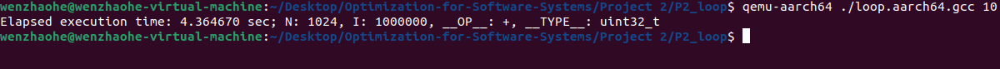

# 软件系统优化 项目报告2
温兆和 10205501432

## 在Ubuntu上安装能够运行aarch64(64-bit ARMISA)应用的Qemu虚拟机（qemu-aarch64）。
### 安装步骤
按照[QEMU搭建arm64 Linux调试环境](https://zhuanlan.zhihu.com/p/345232459)的指导，我们首先运行`sudo wget https://download.qemu.org/qemu-5.2.0.tar.xz`下载Qemu虚拟机的压缩包，运行`tar xvJf qemu-5.2.0.tar.xz`将其解压缩，`cd qemu-5.2.0`进入到qemu的目录下并运行`./configure`，但此后，就接连出现了因为缺少某些包而无法继续安装的问题。如：

解决：`sudo apt install ninja-build`

解决：`sudo apt install pkg-config`

解决：`sudo apt install libglib2.0-dev libgthread-2.0-dev`

解决：`sudo apt-get install libpixman-1-dev`

在解决了这一系列问题之后，执行`make && make install`编译，才在上面那篇知乎文章里读到原来可以直接用命令行安装qemu虚拟机。于是就用命令行重新安装了一遍，以得到最新版本的qemu。

### 安装成功的验证
安装完以后，能够查到qemu的版本，通过Tab键补全检查也能看出qemu工具已经被安装好：

## 安装aarch64的GCC工具链（gcc-10-aarch64-linux-gnu）。
### 安装步骤
首先，确保系统更新到最新的软件包列表：

然后，执行`sudo apt install qemu-system-aarch64`命令安装gcc-10-aarch64-linux-gnu：

### 安装成功的验证
安装完以后，能够查到gcc-10-aarch64-linux-gnu的版本：

## 用aarch64的GCC工具链交叉编译`loop.c (-O2)`，生成可执行文件`loop.aarch64.gcc`，并用qemu-aarch64运行`loop.aarch64.gcc`。
### 编译命令行
一开始，用`aarch64-linux-gnu-gcc-10 -O2 -o loop.aarch64.gcc loop.c`编译文件，结果运行可执行文件时出现了这种情况：

我发现，我的`ld-linux-aarch64.so.1`文件在`/usr/aarch64-linux-gnu/lib`下面，而不是在`/lib`下面：

向学长请教后，我得知，静态编译后得到的可执行文件能够被正常运行。静态编译会将程序所需的所有库都嵌入到可执行文件中，从而避免了动态链接时的依赖关系。所以编译命令行应该是：

### qemu运行的命令行
运行命令行是`qemu-aarch64 ./loop.aarch64.gcc <参数>`。
### qemu运行的结果截图
上面的命令行运行的结果是：

## 用clang交叉编译`loop.c(-O2)`，生成可执行文件`loop.aarch64.clang`，并用qemu-aarch64运行`loop.aarch64.clang`。
### 编译命令行
[使用基于llvm的clang编译arm pwn题目以及arm pwn使用qemu调试脚本](https://blog.csdn.net/fjh1997/article/details/113355908)这篇文章告诉了我们怎么在qemu-aarch64上使用clang交叉编译文件。只要把clang命令的`target`选项设置为`aarch64-linux-gnu`即可。所以，编译命令行就是：`clang --target=aarch64-linux-gnu loop.c -o loop.aarch64.clang -O2 -static`

### qemu运行的命令行
相对应地，qemu运行的命令行就是：`qemu-aarch64 ./loop.aarch64.clang <参数>`

### qemu运行的结果截图
按照上面的命令行编译和运行后，结果是：

## 用qemu-aarch64分别运行前面编译出来的`loop.aarch64.gcc`和`loop.aarch64.clang`（分别用参数5、15、30、60、90 进行测试），记下每次测试的执行时间并以图形方式呈现。
### 测试结果图示化呈现
运行之后，结果如下图所示：
- clang

- gcc

将上述结果用图表进行可视化：

## 用host机器上的gcc和clang分别编译(`-O2`)出`loop.x64.gcc`和`loop.x64.clang`，并对这两个执行文件分别用参数5、15、30、60、90进行测试，记下每次测试的执行时间并以图形方式呈现，进而与前一步qemu仿真测试的结果进行比较。
### 编译命令行

### 测试结果图示化呈现
运行之后，结果如下图所示：
- clang

- gcc

将上述结果用图表进行可视化：

### 分析与比较
我们把四个可执行文件的运行结果放在一起进行一个对比：

我们可以得到以下结论：
- 无论是哪个可执行文件，输入的参数越大，运行时间越长；
- 无论使用哪个编译器，在输入相同的前提下，qemu-aarch64上得到的可执行文件运行时间都要长于host机器上编译出的可执行文件（上图中蓝色和绿色对比、橙色和红色对比）；
- 无论在哪台机器上，在输入相同的前提下，gcc编译得到的可执行文件的运行时间都长于clang编译出的可执行文件，具体的原因在A3中就已经涉及。

## 安装支持多ISA的gdb调试器（gdb-multiarch）。
### 安装步骤

### 安装成功的验证

## 用gdb-multiarch结合qemu-aarch64对loop.aarch64.gcc.debug进行源码级调试。
### 编译生成带调试信息的 loop.aarch64.gcc.debug

### 调试方法简介

在调试前，我们首先输入`qemu-aarch64 -g <端口号> ./loop.aarch64.gcc.debug <输入>`来启动qemu虚拟机。这里的端口号就是等一会儿gdb连接qemu内核时使用的端口号。然后，在Ubuntu中开一个新的terminal，输入`gdb-multiarch loop.aarch64.gcc.debug`命令启动gdb-multiarch，并用`target remote:<刚才设置的端口号>`命令来连接qemu的内核。接下去开始调试就可以了。调试的思路参考了文章[如何在x86架构Linux上使用qemu+gdb调试aarch64的内核](https://zhuanlan.zhihu.com/p/47783910)。

### 调试过程截屏
启动qemu虚拟机：

启动gdb-multiarch：

连接qemu的内核：

在`loop.c`第20行打一个断点，开始调试，进程停在第20行：

输入`continue`，进程继续运行：

