# 软件系统优化 项目报告3
温兆和 10205501432

本次实验进行的顺序是：Checkoff Item 1->Checkoff Item 2->Write-up 1->Write-up 4->Write-up 5->Write-up 6->Write-up 7->Write-up 2->Write-up 3。其中，Write-up 2和Write-up 3的代码改动均基于`./code/homework/sort_i.c`。

## Checkoff Item 1
起初，根据实验手册的说法，编译好`isort`并用`perf record ./isort 10000 10`运行之，出现了如下的问题：

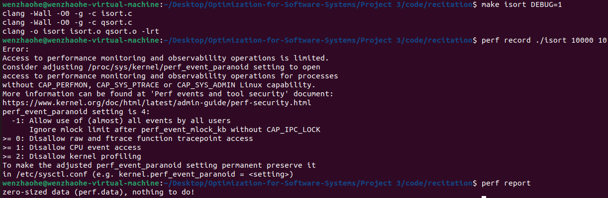

上网搜索后我得知，这种现象可能是由于在我的机器上perf默认需要一定的权限才能运行。在使用`sudo`命令以root权限运行perf，就运行成功了：

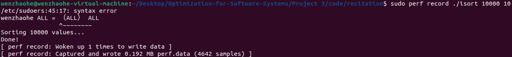

运行`perf report`命令，我们得到：

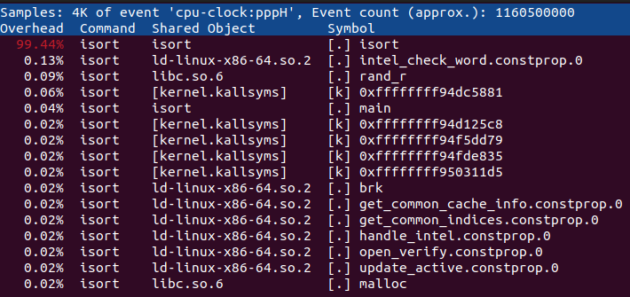

容易看出，`isort`这个函数占据了大多数时间，这可能是性能瓶颈所在。进一步观察代码，我们发现，`isort`函数实现的是插入排序的核心算法：循环遍历数组，将每个元素的值存放在`val`中，然后在已排序的部分（`index`指针）中找到合适的位置，将比`val`大的元素右移，直到找到插入位置。可能这种频繁的右移操作使得内存不停地被重新赋值，导致运行时间过长。

## Checkoff Item 2
按要求在`cachegrind`下运行`sum`，得到如下结果：

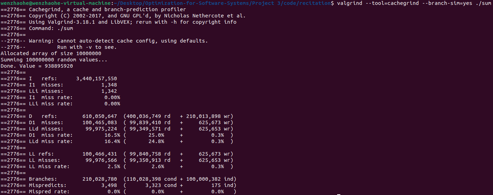

容易发现，D1 miss和LLd miss都比较高。为了减小Cache miss，我们可以适当减小`N`和`U`的值。循环运行了`N`次，随机访问数组元素。如果减少`N`，就会减少随机访问，潜在地减少Cache miss。数组大小为`U`，如果减少`U`，程序的工作集将变得更小，可能更有效地适应缓存。

把`N`和`U`各缩小为原来的十分之一后再编译、运行`sum.c`，我们可以发现D1 miss和LLd miss都减小了很多：

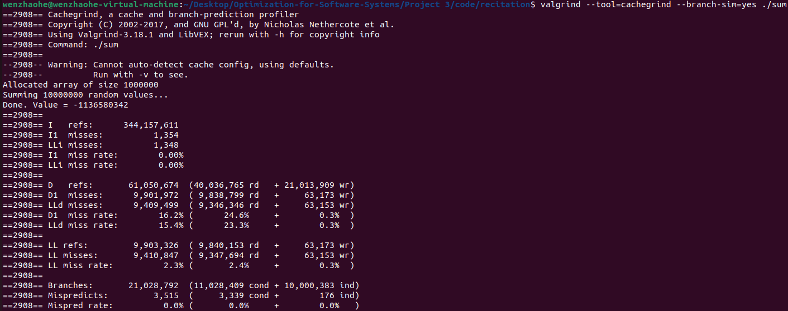

## Write-up 1
经过运行和比较，我们发现`DEBUG=0`的`I refs`和`D refs`比`DEBUG=1`要小得多。在`DEBUG=1`模式下，程序可能包含了额外的调试信息，导致运行时间略有增加。另外，`DEBUG=1`时分支预测错误率上升。这可能是由于调试信息或其他调试构建选项引入的额外分支，导致分支预测性能下降。其他数据相差不多。

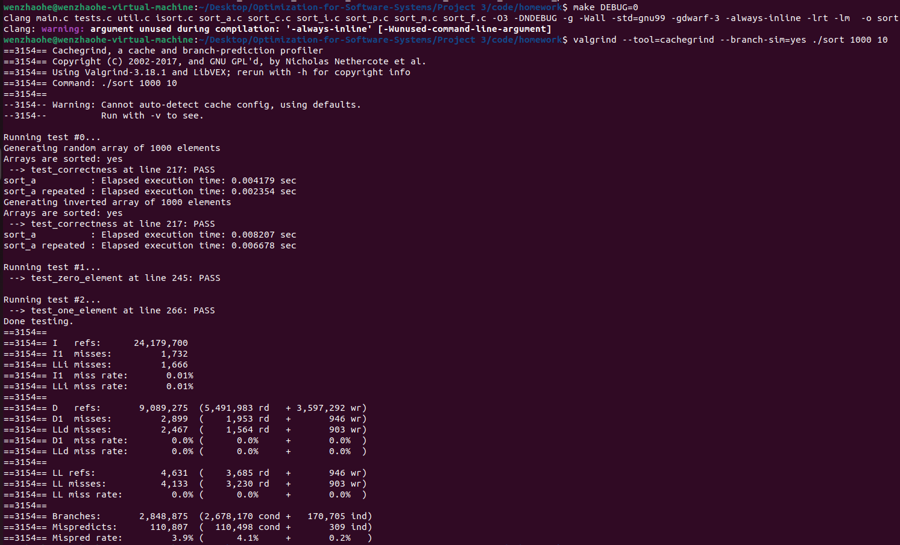

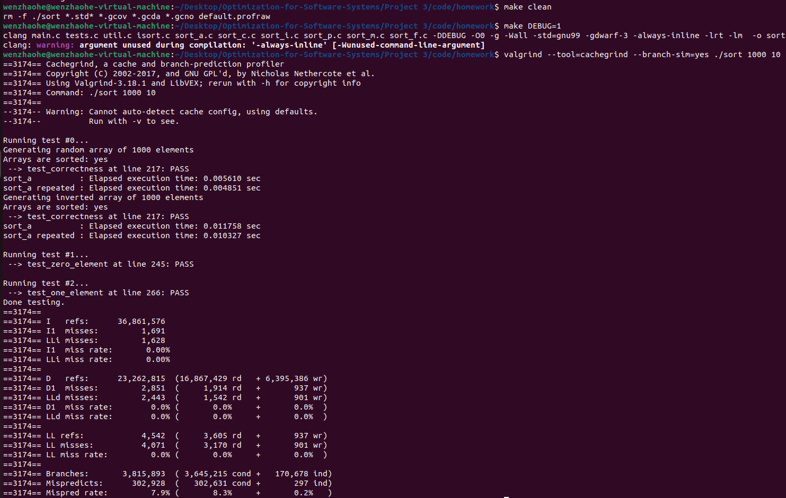

使用指令数替代时间的优势在于，指令数独立于硬件变化和执行环境，更具可移植性。此外，对于给定的输入和代码版本，程序执行的指令数量保持恒定，而时间测量可能受到各种因素的影响，如系统负载、后台进程和I/O操作。

但是，每一条指令的实际执行时间未必是一样的，两个具有相同指令数的程序可能由于指令流水线效率、内存访问模式等因素而具有不同的执行时间。此外，指令数可能无法体现并行执行的好处或开销。

## Write-up 2
我内联了`copy_i.c`、`mem_alloc`和`mem_free`这几个看起来比较短小又经常被调用的函数（见`./code/homework/sort_i.c`）。编译后运行得到的结果如下所示：

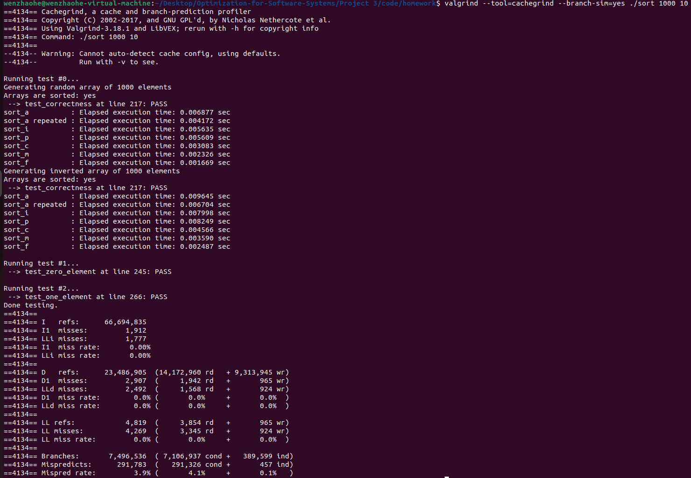

结果显示，对上述函数进行内联后运行时间比不进行内联略有减小。这是因为内联可以减少函数调用的开销。

## Write-up 3
对`sort_i.c`进行如下修改：
```c
// Function prototypes
static void merge_i(data_t* A, int p, int q, int r);
static void copy_i(data_t* source, data_t* dest, int n);
inline void sort_i(data_t* A, int p, int r);
```
编译运行后得到如下结果：

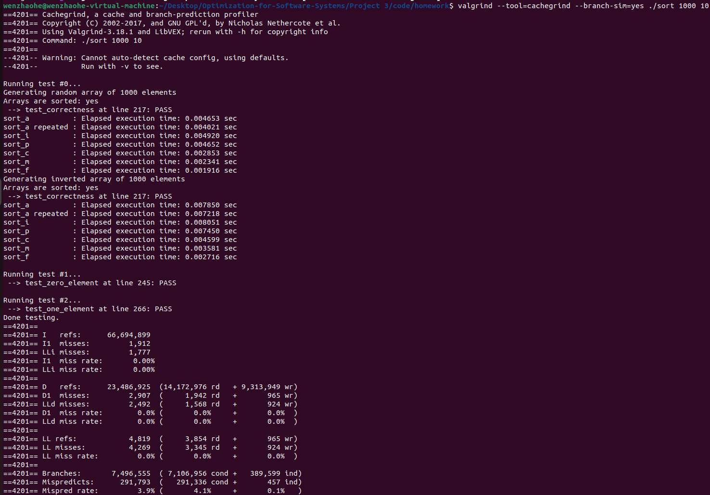

可以看到，内联`sort_i`函数后，`sort_i.c`的性能不如不内联。这是因为内联会导致代码膨胀，每次递归都会生成一份相同的代码。如果递归深度很大，内联展开后的代码量可能会显著增加，导致指令缓存的效率下降，从而影响性能。不过好在实际情况下大多数编译器会忽略开销很大或者不适合内联的函数，使得代码的运行开销没有增大很多。

## Write-up 4
把数组改为指针（具体改动见`./code/homework/sort_p.c`）后，运行结果如下图所示：

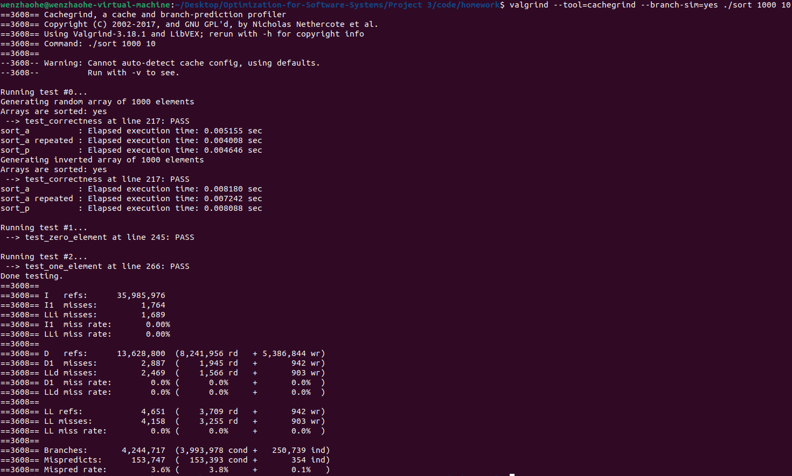

容易发现，修改之后，代码的运行时间有了些许的减少。这可能是因为使用指针传递数组的起始位置和长度，避免了在函数调用时进行数组的复制。这可以减少内存拷贝的开销。此外，使用指针可以直接访问数组中的元素，而不需要通过索引进行计算。这可能在一定程度上减少了一些不必要的运算开销。

## Write-up 5
在这一步中，直接调用`isort.c`中定义的插入排序函数。当归并排序的递归即将到达底层的时候，我们可以使用插入排序，否则用归并排序。注意到当数组长度不大于3的时候使用归并排序会出现“对长度为1的数组进行排序”这种情况，在`./code/homework/sort_c.c`中，当数组长度小于等于3时，用插入排序进行排序，否则用归并排序进行排序。

对`sort_c.c`进行编译并在`cachegrind`下运行，得到如下结果：

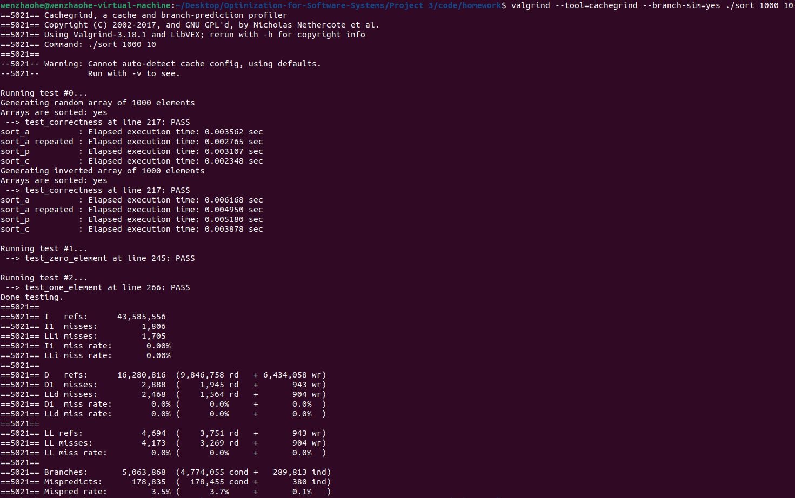

容易发现，`sort_c.c`的性能比`sort_a.c`和`sort_p.c`都要好。可能的原因是，归并排序要递归地将一个数组不断地分成两个子数组并分别进行排序，在运行中要频繁地申请和释放内存，而内存的申请和释放也有时间开销。因此，虽然归并排序的复杂度是$ O(nlogn) $，插入排序的复杂度是$ O(n^2) $，但是插入排序在常数因子上有一些优势，并且对于小规模的数组，常数因子更为显著。所以，在数组长度较小时改用插入排序能够减少内存申请释放带来的时间开销，进而提升程序性能。

## Write-up 6
在这一步中，我们将优化内存使用，使用一个临时内存空间。具体来说，我们通过使用一个临时数组`temp`，并将输入数组本身作为另一个内存临时空间，优化了内存使用。具体的修改体现在`./code/homework/sort_m.c`中。

对`sort_m.c`进行编译并在`cachegrind`下运行，得到如下结果：

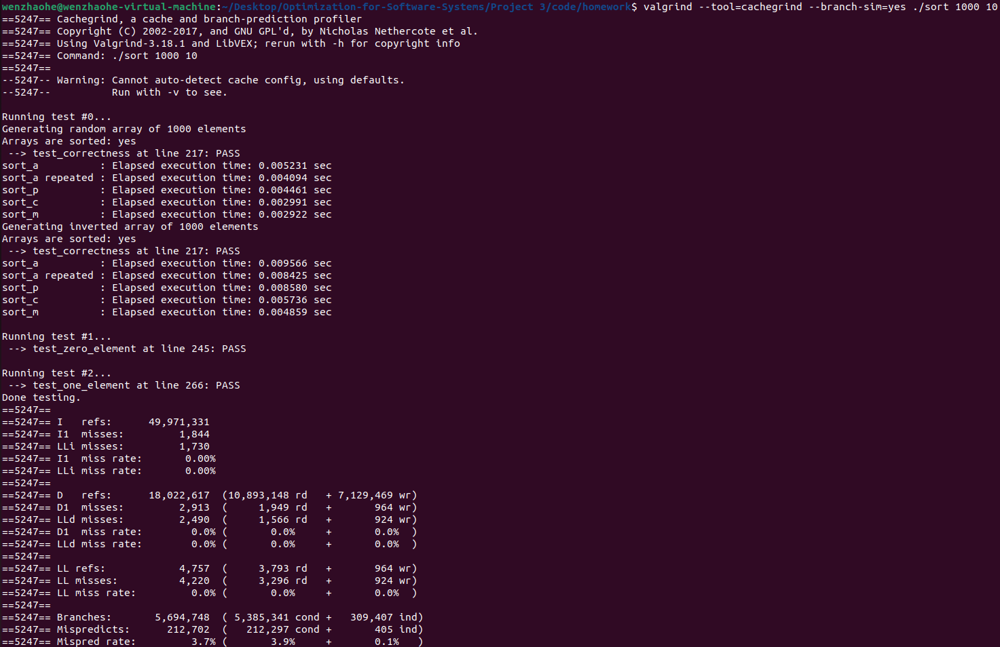

可以看出程序性能稍有提升，但提升幅度不大。

## Write-up 7
这一步，我们将会在排序算法开始前一次分配完所有内存，而不是在每次递归调用的时候才分配内存。具体的代码见`./code/homework/sort_f.c`。

对`sort_f.c`进行编译并在`cachegrind`下运行，得到如下结果：

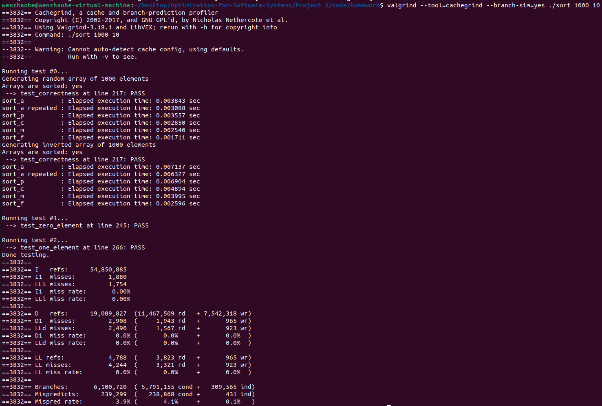

我们可以看到，在使用的内存大小没有显著变多的情况下，代码运行的速度快了将近一倍。这是因为内存分配、释放的次数减少，相应的时间开销也减少了。

## `lscpu`的执行结果

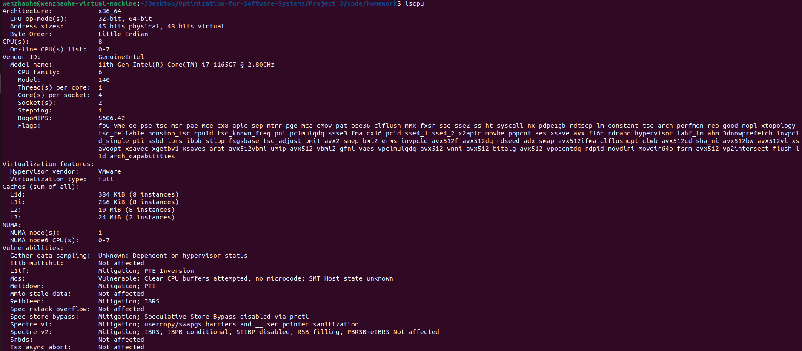